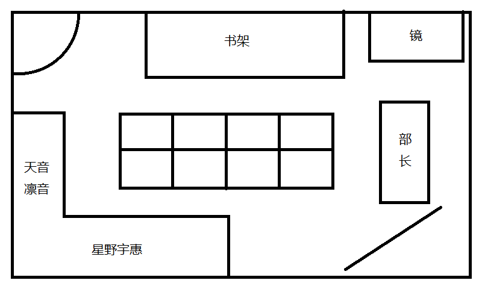

# <center>Code Girl</center>
<center>Lunex Nocty</center>

[toc]

## Capture &#8544;: Hello world!

### 偶然与必然

四月的早晨，空气中总是带着一股花香，路上的行人有些颇多，有锻炼身体的老人，也有需要早起的上班族，但更多的还是各种形色匆匆的学生。

透过马路，已经可以看到行政楼上的大钟了，指示的时间是早上七点五十五。预备铃早就在五分钟之前响过了，但只要在八点之前到达教室就算安全，一年级由于才刚入学不久，应该是万万不敢碰触迟到这条红线的，所以我推测周围的学生应该大多是二年级或者三年级的学生。

我一边按着平常的步速前进，看着时不时就会出现的超过我的学生，一边统计着视线内的学生们的领带颜色，得出的结论果然是三年级的学生是最多的，从这里也可以窥探出枫落高中对于迟到的处罚一定颇为严格，否则不至于让如此多的三年级前辈需要用跑的方式上学。

我对我的体力很有自信，要我从这里跑到教室着实不可能，而我对于流汗一事更是颇为厌恶，自然是不愿意奔跑的。但即便如此我也仍旧不敢迟到，造成我这份余裕的根本原因自然就只剩下距离。

事实上，一年级是离校门口最近的，而我的教室在二楼，并不是很高的楼层，就算按照平常的步伐也未必赶不上，这才是我并没有沦为匆忙赶路的一员，慢悠悠的我自然在人群中多多少少有些显眼，会不会被认出来又成了我另外一个苦恼的问题，好在现在并不会有人停下来细细地打量我，今后我也会避免再发生类似的事情，对于我这个颇有些怪异的一员或许很快就会消逝在记忆里吧。

不过，再怎么说这一切都是我自己一个人的胡思乱想，或许我并没有想象中的那么令人关注也说不定。

至于我为什么今早上会在如此极限的时间到达学校，则是因为昨晚喝多了茶导致直到半夜精神都有点亢奋……

这个话题暂且略过，因为我发现了我的鞋柜面前正站着一个熟悉的人——天音凛音。

「天音同学？」她似乎还没有发现我，眼睛盯着自己的手机，站在A班的鞋柜之前，显然是在等人的样子，至于在等谁，显然是在等我了，毕竟手上拿着的正是昨天不小心和她拿反了的笔记本，一股歉意油然而生。

天音同学瞬间抬起头来，才注意到我已经站在她面前了，一瞬间的表情有点惊慌失措，差点将手机扔在了地上，不过还好她反应即时，拿稳之后收进了跨在左臂的包里。不然我的罪过又多了一条。

经过了两三秒的沉默，天音同学似乎才终于想起来自己为什么会在这里，「这个，笔记本」右手指了指左手上的笔记本，又指了指我，然后稍微后退了一下，「对不起！」向我展示了一个完美的九十度鞠躬，弯腰的同时双手将笔记本递了过来。

我的思绪也一时有些混乱，「额，谢谢……」没想到自己只是小小的打个招呼，天音同学会有这么大的反应，以至于我下意识的接过了笔记本，就眼睁睁看着天音同学冲上了楼梯，消失在了视野中。

我才注意到，我不仅没有道歉，甚至连笔记本都没有归还回去。

我甚至可以想象得到，凛音由于不知道笔记本的重要性，而且和我一样不知道对方的住址，所以只能一大早的来到学校，在鞋柜前等着，说不定，在这里一个人等了半个多小时也说不定，而我今天恰巧由于失眠起的很晚，不，失眠也是我昨晚没有听从母亲的劝告才导致的，所以归根结底都是我的错吗？追根溯源，导致凛音不得不一大早等我的原因便是由于我将笔记本拿反了，为什么我当时就没能更加仔细的确认一下呢？

本来想追上去却也由于上课时间将近而未能遂愿，只好在郁闷之中度过了第一节物理课，虽说不至于走神，但也说不上全身心投入，好在这节课更多的是对上次开学考的知识点的总结，倒也不至于跟不上。一下课，我便来到了三楼，一间一间地找过去，一年D班在三楼最里侧的教室。

「天音同学？她的话，一下课就不知道去哪儿了，可能是去厕所了吧。」镜如此回复我。虽说由镜转交是个很不错的方案，但是由于已经知道这个笔记本不是那么急用，因此，亲手还给天音同学这个行为便有了意义，但一时之间我也无从判断天音同学到底去哪儿了，直到课间快要结束了还没有回来，我只好从东边的楼梯口回到了我的教室。

第二节课是藤原老师的数学课，先是表达了这一次对同学们考试结果的失望，自然引起了学生们的不满，当有同学质疑考试题目是否超纲的时候，藤原老师干脆的承认了超纲的事实，使得教室里议论纷纷。不出所料的，在他说出就算是在超纲的考试中，都有人拿了满分的是时候，同学们便进入了他的节奏，这节课很好的树立了藤原老师的威信，为他以后的教学奠定了良好的基础，却也让我承受了不必要的恶意，虽说现在还未显现，不过当成绩公布之时必然会如潮水般涌现而出的吧。下课之后，我被藤原老师叫到了教职员室，只好将天音同学的事情放在了一边。

第三节课是古汉语文学，这种有些小众的课程是枫落高中的特设科目，我在汉语文学方面一窍不通自然不用担心出现第二节课的窘境，不过一位名叫柴崎静(しばさき しずか)的女生却大放异彩，古汉语文学的櫻井梨美(さくらい りみ)老师对柴崎同学似乎有颇多的共同语言，两人在课堂上的对话却让包括我在内大部分人都听不太懂。我和柴崎同学并不怎么熟识，不过她确实给人一种文学少女般的印象。第三节下课后，我便再一次来到了一年D班，天音同学和镜却都不在，从一位同学口中得知镜被叫去了职员室，而天音同学却没人知道去哪儿了。

连续三次都由于各种原因没能找到天音同学让我的心情更加的烦闷，虽说有着事不过三的说法，但对于午休时能否碰到天音同学也产生了很多怀疑，虽说枫落高中的午休时间有70分钟，但未能掌握天音同学行动模式的我并不会由于多出的自由时间而获得额外的优势。笔记本在我这里留存的越久，心中的愧意便增加一分，虽说通过前两次接触基本上可以判定天音同学并不是小肚鸡肠的人，但这并不能成为我脱责的借口。

上完并没有任何风波的第四节英语课，终于进入了午休的行列，这一次，镜却先一步找到了我，我才知道我已经没有必要继续寻找天音同学了。

「啊哈哈～哈哈～这也太过巧合了吧！」在天台上，面对狂笑不止的镜，我心中有些不高兴，不过诚如镜的评价，一切都太过巧合了，我和天音同学都在互相寻找对面，却又一次又一次的错过。直到午休的时候，天音同学才拜托镜转告我，让我下午放学后去社团活动室把笔记本归还给她，不过我更愿意相信这是镜的主意，她想让我加入代码社也不是一天两天了，但这次情况特殊，倒也由不得我不答应去社团活动室走一趟。

看似是偶然的堆砌，却也发现了我与天音同学在思考方式上的相似之处，正是由于这些相似，才导致了这一系列的结果，如此看到，发生这种情况倒也必然。现在站在局外的角度，我才注意到我当时忽略了一个最大因素——镜。镜和天音同学是同班同学，对我又知根知底，就算平常再怎么不和天音同学交流，这个时候也会告知天音同学关于我的事情，而我也忽略了天音同学在知道原由前后存在的行为目标的变化。或许是我太过在意天音同学而导致思考能力下降了吧，不然我未必不能在第三节课的课间将笔记本物归原主。不过这就不足为外人道了。

回到教室后，整个班级的氛围都变得有些异常，似乎都在讨论开学考的分数，我才想起开学考的分数确实是在今天——开学后第二个星期四公布。家里几乎从不问我的分数，我也没有在分数上证明自己的想法，因此我倒也不在意开学考的分数了，现在这个时间，四楼的E班和F班应该正围在公布栏前，我倒也不想在如此多人的情况下去确认分数，反正数学的分数我昨天就知道了。正当我准备回到我自己的位置上的时候，而大部分人的目光仍旧集中在我身上的时候，我就意识到了不妙，虽说大部分的目光并没有恶意，但被人注视的感觉着实说不上好。

下午的课程就这样按部就班的结束，随着三点半的钟声响起，枫落高中除学习之外的另一半生活——社团活动正式拉开了帷幕。

由于之前的约定，我并未像往常一样直接回家，而是前往了社团大楼504室，到一楼顺便查看了一下考试张贴的排名，看到排名第一的成绩心中也是有些高兴，前几位的差距并不怎么大，除了数学以外的其他科目，我都只排在第二三位的程度，古汉语甚至排到了十名开外，如果不是数学恰好拿了满分，而数学考试的难度又很大，或许我只能排在三四位吧，这所学校的竞争还真是激烈，收拾了一下由于在第一次考试中拿了不错成绩的我的心情，我便径直走向了社团大楼。我们学校除了行政楼外都没有电梯，而社团大楼5层楼的高度让我望而却步，好在我不用赶时间，倒也慢悠悠的走了上来。来到504室，在门口发现了写着『代码社』牌子，让我确信我没有走错地方，我敲了敲门，很快传来了回应。

「打扰了~」我拉开了门。映入眼帘的是一个不到40平方米的小房间，里面的陈设显得十分整洁，最先注意到的是房间正中央的由8张课桌拼凑而成的会议桌，南面和西面靠墙摆放了一张直角办公桌，目前都没有人在，东南边有一个白板，正对着会议桌，东边靠墙也摆放着一张桌子，面前坐着的人正是昨天有过一面之缘的小宫夜羽前辈，至于北方，则靠墙摆放着一个三层高的书架，视线内还捕捉到了金色的发尾，想必里面还有一张桌子，是镜的座位吧。果不其然，听到我的声音后，镜就立刻从座位上站了起来，来到了我面前。


<center>图1-1 社团活动室布局示意图</center>

「宇惠，你来啦，学姐，她就是宇惠。」小宫前辈也立刻从座位上站了起来，慢慢地向我走来。

「您好，前辈。你好，镜」向三年级的前辈略微弯腰行礼。

「你就是……星野宇惠同学？」虽说有过一面之缘，但似乎我昨天并没有给前辈留下深刻的印象呢。「在开学考就获得一年级榜首，数学更是拿了满分的……星野宇惠吗？」

「只是运气好罢了。」我刚说完，镜才似乎想起了什么，补充道，「啊！宇惠是来找天音的，昨天她们在楼下撞到了，不小心把笔记本拿反了。」

「是的。」看来镜还没来得及将我的来意告诉前辈，我也即时的补充了一句，「我正是来归还天音同学的笔记本的。」

「天音还没有到，你先坐下等一下吧。」前辈也迅速理解了我的来意，我便坐到了会议桌面前。「咖啡可以吗？」可以的话我想喝茶，不过一般的社团应该不会常备茶叶吧，但也不可以浪费前辈的心意，便点了点头。很快，一杯速溶咖啡便送到了我面前，我双手接过，表示了感谢，前辈也端着一杯咖啡在我对面坐了下来，首先打开话匣子的果然是镜。

「学姐，你知道吗？她们两个超搞笑的，昨天丢了笔记本之后，天音今天一大早就到鞋柜那里等宇惠，结果宇惠快上课了才到学校，弄得天音差点迟到，快要上课了我才看到天音匆匆回到教室，之后宇惠来找天音，结果天音去楼下找笔记本了，我告诉天音之后，两个人互相寻找，结果每次都恰好错过！一般来说会出现这种巧合吗？要不是最后碰到了我，估计宇惠是没办法亲手将笔记本归还了。说道这里，宇惠今早怎么会那么晚才到学校？平常的话不是起的很早的吗？」

总是跟不上镜的节奏，她总是说到哪儿想到哪儿，刚刚还在说我和天音同学之间的趣事，立刻又将话题转到了我早晨起得晚的话题上，额，我该怎么回答呢，总不能说茶喝多了导致失眠吧……我可不想在前辈面前留下冒失的印象。

「稍微遇到了点问题，睡得有些晚。」我将思考得到的答案说了出来，被镜一声「哦」带过了，看得出来她根本不在乎什么原因，只是单纯想到了就说出来罢了，正是由于镜是这样的性子，我才免于被追问的命运。

「话说回来，宇惠，难得来一次代码社，不参观一下我们的社团活动吗？」啊，原来是她终于想起来她忽悠我来社团的目的了吗，不过虽然这么说，但自从我来到这里之后就只是单纯地聊天欸。

据我所知代码社存在着废部危机，所以前辈倒也在宇惠的示意下立刻明白了镜的意图，「那么，星野同学要参观一下我们的社团活动吗？」我完全没有拒绝的理由，只得答应。

### 社团活动初体验

「那么，首先，星野同学对计算机了解多少呢？」前辈问道，计算机？能代替大脑做运算的那个？比起机器，我更喜欢用纸笔来解决问题，虽说经常被镜吐槽落后于时代，但用纸笔也没什么不好吧。

「能够代替大脑进行计算的机器吗？」

「答案对，但也不对，这不是我想听到的答案呢。」小宫前辈似乎是不满足于我的类似百科上一样的回答。

「学姐，宇惠对电子产品一窍不通啦，连手机都不会用，明明家里就有一台性能超好的电脑，却一点也不知道利用，遇到一点问题就会哭着来找我……」镜立刻开始暴露我的黑历史，我却只能感叹交友不慎罢了。

「那么，能请水野镜同学为我解释一下什么是计算机吗？」我打断了镜的话，毕竟我可不记得我有哭着找镜帮我修电脑的记忆。

「哼哼，计算机就是一个世界，一个由数字构成的宏大世界，能创造出不存在于现实的一切！」镜颇为自豪的说出了以上发言，然而我却并不能理解出什么叫『创造出不存在于现实的一切』，难道计算机不是现实存在的东西吗？

「这么说到也没错。」小宫前辈居然对镜的回答表示了赞同，有点出乎我的意料。「计算机构建了一个仅由0和1构成的逻辑世界，或者说，由数字描述的世界。所以，一切可以用数字描述的东西，都可以在计算机里模拟出来。」

「呵呵呵\~对吧\~」，镜看向我，露出了得意的神情。

「但这也不是我想要听到的答案呢。」，镜的笑容凝固在了小宫前辈的话里，小宫前辈解释道，「你们似乎都把目光集中在了计算机能做什么上，诚然，一开始计算机被设计出来就是为了帮助人们进行计算，然而，随着技术和时代的发展，计算机能做的事情也越来越多，无论是帮助人类进行计算，还是如小镜所说去构建不存在的世界——比如说形形色色的游戏世界，这都只不过是现代计算机的应用而已，而它的应用却可能比你们想象的可能要更加广泛。」

「那么，计算机是什么？夜羽学姐可以给我一个准确的定义吗？」，小镜有些不服气的问道。

「在我看来，计算机是一个工具，一个可以对数据进行存储和操作的工具而已。」

「对数据进行存储和操作吗？」，我还是第一次听到这种说法，感觉有点意外。

「是的，无论是以前的电子管，还是现在的超大规模集成电路，甚至是未来的光子计算机，计算机的本质终究是对数据进行存储和操作罢了，和它是用什么东西做的，能用来做什么都无关，或许计算机以后还能在我们所未知的领域大放异彩，毕竟没人能准确预言人工智能最后能发展成什么样子不是吗？」

「工具本身和它的应用也会随着时代的变化而变化吗？」，这点我倒是能理解。

「总结的很精辟呢\~差不多就是这样。」

「那么，这个和社团活动有什么关联吗？」，我问道。

「计算机能按照程序完成各种各样的事情，人类负责设计和实现程序，实现程序的方式，就是利用计算机语言去描述算法，啊，算法简单来说就是一系列可以在有限的时间内执行并得到结果的指令集，或者说步骤，这样计算机就可以完全按照程序去执行，完成各种各样的操作。所以我们代码社的主要活动内容就是学习如何去设计和实现算法，利用好计算机这一重要的工具。」

「感觉和计算机研究社一样？」，我突然想到了那个由一群游戏玩家组建的计算机研究社，但单从社团的名字上来看，也是研究计算机的来着。

「我们社团不研究计算机，也不研究计算机的应用，更不是研究游戏电玩的！」，小宫前辈似乎想起来什么，语气略有些激动，但很快恢复了过来，还扭过头去看了镜一眼，才接着说道，「我已经说过了，我们社团的活动内容是学习如何设计和通过计算机语言去实现算法，学习如何去编写程序代码，所以我们社团的名字叫代码社，请不要把我们和挂着计算机研究社外皮的电玩社搞混淆。」虽说小宫前辈似乎没什么变化，我意识到我似乎是踩雷了，却不知道该说些什么，好在小宫前辈继续说了下去，才没有让气氛变得尴尬。「在这个逐渐进入智能化的时代，掌握好计算机这个工具一定会有所裨益的。首先，用代码去实现算法不仅能加深对算法本身的理解，这个过程也是非常有趣的。从自我提高的角度来说，它提供了一种解决问题的思维方式。再实际点来说，它能让你毕业之后能找到一份高薪的工作。」

小宫前辈显然比那些单纯的用有趣和友情青春之类的来劝诱新人的部长要高级的多，有不有趣我不知道，但是第二个和第三个却着实是大多数人想要的，我听完之后甚至有种比起其他社团，加入代码设能获得更多成长的感觉。内心有点意动，但我并不是一个容易被煽动的人，冷静的思考下来发现，我对计算机并不依赖，对于我来说，完全没有必要非要学会怎么去利用计算机，更加重要的是，我不感兴趣。不过经过小宫前辈的大量说明，我大概知道了代码社是一个学习如何利用计算机的社团，掌握这项技能的话，今后应该会很好找工作吧，我事不关己的想着，看来镜也算是进了一个很正经的社团，希望能在社团学到很多东西吧。在心中默默为小镜送上祝福，我也在脑海中思考着拒绝的言辞。

「不去亲自试一下怎么知道自己会不会喜欢呢？」，镜的话让我刚刚想好的借口瞬间胎死腹中，难道她看出来了我会拒绝吗？也是，我都拒绝了她那么多次了，正当我寻找除了兴趣以外的借口的时候，被镜拉了起来，「来尝试自己写人生中的第一个程序吧！」我有些局促的看着小宫前辈，她却突然笑了笑。

「是呢，不实际体验一下的话，是没办法理解的呢。我居然忘了这么显而易见的事情，那么，小镜，你就指导星野同学完成她的第一个程序吧，嗯，当然是从『Hello, world!』开始。」

「欸？等……」我被镜强硬地拉到了她所做的位置上，被迫坐在了她的笔记本电脑前，正面面对着这个我怎么都用不熟练的东西。「环境我已经全部安装好了，我会在旁边一步一步地教你，所以什么也不用担心哦！」

不知为何感觉镜有点兴奋，但我还是在此打断了她，「那个，『Hello, world!』是什么？」回答我的是跟着一起来到我身后的小宫前辈，「是一个程序，功能只有一个，就是在屏幕上输出『Hello, world!』这样一句话，非常简单，但非常具有代表性。」

「传统哦，这是传统哦！撒啊！快点开始吧！」在镜的催促下我将我的注意力转移到眼前的这台电脑上。「首先，嗯，先建立项目文件夹吧！欸多，叫`Hoshi`就好了吧？这个文件夹是一个项目的起点，如果要开始什么第一件事就是建立项目目录，现在新建一个名为`hello.c`的文本文件，然后就用你最熟悉的记事本打开它，然后开始编辑内容吧！」

我用记事本打开了刚刚新建的文件，看着白色的文本编辑的界面，回头问道，：「该写什么呢？」镜似乎是愣了一下，隔了两三秒才继续说道，「我念，你写。」，总觉得镜有点奇怪，算了，还是先关注眼前的事情吧。我在空白的记事本上逐字符敲下了这样一段代码。

```c
#include <stdio.h>
int main(int argc, char* argv[]) {
    printf("Hello, world!");
    return 0;
}
```

仅仅只有4行所谓的代码，加上第5行的一个大括号，这就是全部。在镜的提示下使用快捷键保存了之后，小宫前辈的声音再一次响了起来，「现在不理解这些也没关系，只需要记住的只有，这是你自己完成的，用你的这双手。」

「然后，左下角的开始菜单，查找一个叫命令提示符的程序，直接搜索`cmd`就好了，对对，就是那个，双击打开它。」，一个漆黑的窗口突然出现在我的面前，「这个是命令行窗口，是程序员和电脑直接交流的地方哦，现在直接在里面输入命令吧！」和写代码的时候一样，还是镜在旁边念，我负责敲下一个又一个字符，虽然由于我对键盘不熟悉导致刚才写代码花了很久的时间，镜似乎并没有因此厌倦的样子，但我还是尽可能加快了敲键盘的速度。

```bash
$ cd Desktop/Hoshi
$ g++ hello.c -o hello
```

「这样吗？」我按下了回车，但什么也没发生，我正想询问的时候，镜让我打开我刚才新建的文件夹，「这里多出来一个`hello.exe`文件，看到了吗？这说明你刚才写的代码已经成功变成了可以运行在Windows上的程序了哦。那么，让我见识一下你的成果吧！这个程序是否能按照预期正确输出`hello world!`呢！让我们拭目以待，接下来就是见证奇迹的时刻！」不知道镜在模仿谁，但我竟然也对接下来会发生什么产生了一丝期待，真的会打印出来吗？那个『Hello, world!』。

按照镜所说输入执行的命令，按下回车之后，我目不转睛的盯着屏幕，几乎就在我按下回车的瞬间，十三个字符出现在屏幕上。

```bash
$ hello
Hello, world!
$
```

像是在向我打招呼，又像是我在向它打招呼

一股奇妙的感觉涌现，有种我征服了面前这台机器的错觉，这……是我做的吗？虽然这一切都是我自己完成的，镜只是在旁边指导，但我却完全不知道我刚才做了什么，不过，我确实在看到`Hello, world!`的一瞬间感到了一种愉悦，一种和我解决了一道颇难的数学题一样的成就感一样的愉悦，这瞬间的愉悦有朝一日或许会萌发出兴趣的种子，亦或是在向一个新世界的第一次招手——你好，世界！。但至少，现在的我无暇去思考如此久远的未来。

打断我这小小的喜悦的是开门的声音，很快，一个有些熟悉的声音传入我的耳中，我忽然想起来我来此地的目的。

「对不起，我迟到了，今天我值日。」我从座位上站了起来，果然看见了天音同学。她正打算关门，也突然发现了我，我们两个就这么对视着。很快，天音同学的脸迅速的变红，就要转身离开，或者说向座位逃去比较符合。

「啊，天音同学，等一下！」趁着她愣住的瞬间，没有在意突然有点失落的镜，我走到会议桌上，从包里拿出早就准备好的笔记本，「对不起，我是星野宇惠，这是你的笔记本，现在物归原主！」，走到她面前，面对着她，学着她今天早上的姿势，将笔记本递了出去。

「啊……谢谢」天音同学也是小小的愣了一下，接过了我手上的笔记本，简直和我早上的反应一模一样，唯一不同的是我并没有就此离开，因为我还有一件不得不道歉的事。

「那个——今早上的事，对不起，由于一些个人原因所以来的有些迟，我不知道天音同学会在那里等我，让你等了很久，真的，对不起。」

「没……没关系……那……那个……我……我……我先告辞了……」说完，天音同学便立刻逃走了，来到了西面墙壁前的一个座位上，将书包放在旁边，坐了下去，不再看向这边，嗯……这种奇怪的挫败感是怎么回事？不过，看到天音同学明显不再想搭理我的举动，我只能选择放弃。

转过身去，刚好看到正看着我的镜和小宫前辈，我意识到突然把两位晾在一边是很失礼的行为。「多谢小宫前辈的指导，以前都不知道编程是如此有趣的事情，受益匪浅。顺便镜也是。」

「如果对编程产生了那么一点兴趣的话，随时欢迎来活动室学习。」小宫前辈仍旧是非常靠谱的前辈形象，而且似乎也察觉到了我的拒绝之意。总之，来代码社的目的已经达成，而且也体验过了代码社的社团活动，这样子的话，就算是镜也会干脆的放弃了吧？我乐观的想着，目光飘过东面墙壁上的挂钟，已经四点多了，不知不觉我已经逗留了半个多小时吗。

「再一次，感谢指导，我先告辞了。」我行了鞠躬礼之后，切换了较为随意的态度，「那么，镜，社团，加油哦！拜拜」

「唉，好吧，拜拜。」彼此转身，我拿过放在中间椅子上的书包，径直向着门口走去。

### 镜与镜像点

「等等！」突然起来的声音让我停下了开门的动作，转身望去，发现一来就躲着我的天音同学正拿着笔记本看着我。「这个，你写的？」天音同学站了起来，指着我昨晚上留下的笔记问道。我才意识到我昨晚上究竟做了多么大胆的事情，竟然擅自在别人的笔记本上写东西。

「啊！这个，对不起，一不小心就……」这下肯定会被讨厌的吧。

「比起这个，我更想问，这个，怎么解出来的？」天音同学指着我所写下的答案，一脸好奇的看着我。看来我和天音同学属于不同的类型，心中的大石头落地，瞬间舒缓过来。

「嗯？什么题？」我和天音同学的对话似乎是引起了小宫部长的注意，她凑到了天音同学的面前，阅读着题目，粗略的看了一眼，接着说道，「这个题，我倒是知道答案来着，不过对于怎么从递推公式得到通项倒不是特别清楚，星野同学是用的什么方法呢？」

「可以倒是可以」我并没有任何拒绝的理由，而且心中对天音同学的歉意也让我没法拒绝，所以我又回到了座位上，拿出了草稿纸和笔，示意她们坐过来，我在草稿纸上写下数列两个字，一上一下分出两条线，上面连着递推公式，下面连着通项公式，说道，「我一开始的思路是顺着天音同学给出的递推式继续前行，通过递推式推导数列的生成函数的幂级数形式，也就是Generating function。」一条线从递推公式向右出发，通向幂级数，「由于我们知道递推式，通过代数计算，可以得到生成函数的解析形式」我把生成函数四个字圈了起来，再往左划出一条线，连接到泰勒展开。「然后把生成函数在$x=0$点泰勒展开，由于我们一开始就定义了数列的项与幂级数的系数一一对应，因此泰勒展开后的一般项的系数就是数列的通项公式，这就是整体的思路。」终于，将泰勒展开和数列的通项之间互相连接，回到了数列的领域。最后，我用一句话来进行了总结，「简单来说，就是通过生成函数定义了一种从数列到连续函数之间的映射，这样就可以通过对函数的操作实现对数列的解析」

我留出了一点时间，让她们消化我的解题思路，观察着几人的表情，除了小宫前辈之外，天音同学和镜都是一脸茫然，这很容易理解，因为这根本不在中学的教学范围内。活动室却也因此陷入了短暂的沉寂。

打破这份沉寂的是小宫前辈，「这个方法就暂且先跳过吧，要理解这个方法需要一些前置知识，不是一时半会儿能讲清楚的，星野同学也说过这是一开始的思路吧？你应该还有另外一种方法对吧？」「是的，后来我发现答案的形式是排列数的形式，所以我用排列组合的方式重新思考了一下，发现这确实是可行的。」小宫前辈似乎总能看穿我在想什么，总是在不经意间替我解围，我乐于接受来自前辈的好意，于是开始讲解起用排列组合的思路来解决这个问题。

「这个题目要求的是不同计算顺序的种数，而能唯一确定计算顺序的，就是括号在原来的式子种的位置，根据括号的位置的不同，自然计算顺序也不一样，这样表述题目的话，就可以很轻松的看出这是一个排列组合的题目，我们需要在矩阵连乘的表达式里面插入括号。」由于昨晚已经思考过，因此我省略了我昨晚的大部分思考，用我认为更容易理解的方式展开了思路。这一次似乎卓有成效，至少在天音同学的脸上我看不到刚才的那种茫然，就连镜也是一副若有所思的样子。

「我们随便写出一个计算顺序的式子，比如$((A_1 \cdot A_2) \cdot (A_3 \cdot A_4))$，如果去掉式子中所有的矩阵符号和右括号的话，我们得到的式子就会变成这样$((\cdot\cdot(\cdot$，这个式子仍然可以唯一确定一个计算顺序。」

「等一下！」果然，镜在这里打断了我的发言，「这个式子怎么就唯一确定了一个计算顺序了？我完全没看出来，去掉右括号的话不就不知道先算什么了吗？而且这不是算矩阵连乘的吗？连矩阵都去掉了是闹哪样？」对于这个问题我早有预料，「你在$(\cdot$的右边添上右括号，再在$(\cdot)$的乘号两边添上矩阵的符号试试？」，镜很快接过了我的笔，在纸上写着，「大概这样子$((A\cdot A)\cdot(A\cdot A)$，还是没有还原啊——欸？」

「发现了吗？$(A\cdot A)$本身也是矩阵，所以还可以在最右边添上最后一个右括号，就和我们最开始的表达式一样了。」

「正如镜演示的那样，对于任何一种计算顺序，我们去掉矩阵符号和右括号之后，仍然是可以还原的，所以我们可以只关注与左括号和乘号的位置就可以了。观察这个表达式，它包含了三个左括号和三个乘号，一共六个符号，也就是说，我们需要在六个符号中插入三个左括号来决定运算顺序。从六个空位中插入三个左括号的排列有多少种呢？」

「等下，我算算！」镜立刻拿过草稿纸开始数，天音同学则淡淡的说了一句，「$C_6^3$」，很快，镜也完成了她的计算，「20种！我肯定没错，天音你算错了。」

「两位都很正确。」我很高兴我能将我的想法传达给她们，这种少有的体验让我感到很兴奋，虽然初中时我也经常教别人学习，但更多的是她们应付作业罢了。

「但是，当$n=4$的时候一共只有5种计算顺序，不是20种啊？」，很快，从旁边传来了质疑声，是沉默多时的小宫前辈提出来的。

「欸？对欸！」镜后知后觉的附和道，天音同学只是认真的看着我，似乎在等待我给出接下来的解答。

「是的，所以，我们要把错误的排列从这$C^3_6$种中剔除出去，错误的排列就是指不可以确定一个计算顺序的排列，镜，你尝试按照你刚才的方法把右括号和矩阵符号A还原到表达式中看看？」由于镜刚才已经把20种排列写在了草稿纸上，因此，镜很快便开始『还原』表达式。

「有些表达式没法还原欸。」镜很快就发现了问题，「不能还原的直接跳过。」我提醒道。镜很快便还原出了5个表达式，正是当$n=4$时的5种不同计算顺序。

镜数了数，「刚好5个！」不多不少。我总结道，「不是所有的表达式都可以还原，而可以还原的表达式，则唯一确定了一种计算顺序。」

「镜，帮大忙了，那么，你觉得什么样的表达式不能还原呢？」

「额，式子左边总是多了一个乘号，所以我没办法添加右括号把这个乘号包进去。」看来她也发现了这一点，看来镜也是有在思考的嘛。

「非常正确，左边多出了一个乘号的不能还原，我换一种表述方式，就是说这个式子的所有前缀，左括号的数量如果小于乘号的数量，就会导致左边总是会多出一个括号，使得整个表达式不可计算，也就是说没法还原成可以计算的表达式。」

「意思我理解了，但是要怎么把这个条件应用起来呢？」

「我们画一个图吧。」我从镜手上接过笔，画了一个3x3的网格，在左下角标注(0, 0)，「我们从这个点出发，往右边走一个表示加一个乘号，往上走一格表示要加一个左括号，从(0, 0)到达(3, 3)需要6步，路径的条数也就是$C^3_6$，一共20条，镜不用数了，6步中有3步是往上走，这三步可以插在任意位置所以直接根据组合的定义写出答案就是了。现在我们的要求是所有前缀的括号数不得小于乘法的数量，在这张图上表述出来就是这个路径不可以碰到这条直线。」，我画了一条$y=x-1$的直线在网格上，并把这条直线和网格的焦点圈了起来，「这些点以及这条直线下的点都不满足当我们走到这里的时候括号的数量不小于乘号的数量，而网格中的其它点都满足这个条件。」

「到这里为止我大概明白了，接下来怎么做呢？」镜思考了一会儿后问道。

「接下来就是想办法排除所有接触到这条直线的路径，至于怎么做——还记得你照镜子时候吗？」

「镜子？」镜的名字就是镜，当然随身带着镜子，然而她翻来覆去看了好久，都没想明白其中的关键。反倒是一直话比较少的天音同学说道，「星野同学的意思是把这条直线当成镜子？」随即，小宫前辈也露出了恍然大悟的神情，「镜像点么，真是巧妙的方案。」

「是的！」

「什么什么？到底是怎么回事嘛！」始终找不到头绪的镜不停的问着，小宫前辈代替我拿过了笔，一边沿着网格画路径一边讲，「把这条直线当作镜子，那么，所有碰触到这条直线的路径在第一次碰到直线之后交换前进方向，最后到达的点一定是目的地(3, 3)关于这条直线的镜像点(4, 2)。这样我们就把不满足条件的排列全部剃了出来，我说的对吗？星野？」

「是的，非常正确。」在得到我肯定的答复之后，天音同学跑回座位上，拿出了她的笔和草稿纸，开始计算一般化后的表达式，没再理我们三人。

「$C^2_6$的结果是15，20减去15，果然是5——哦！我觉得我也明白了！」镜欢快的说道。「那么，就请小镜完成最后一步！」小宫前辈将笔交给了镜，镜当场愣住。「那……那个……我……我……我觉得我还是没懂……」我只好代替镜接过了笔。

「刚才我们讨论的是$n=4$的情况，当$n=4$时有3个左括号和3个乘号，所以我们的目的地是(3, 3)，现在有n个矩阵，那么就有n-1个左括号和乘号，我们的目的地是(n-1, n-1)，不满足条件的都可以通过镜面到达(n, n-2)这个点。到达(n-1, n-1)的路径条数为$C^{n-1}_{2(n-1)}$，减去到达(n, n-2)这个点的路径条数$C^n_{2n-2}$就是最后的答案。」，我在草稿纸上写下了最后的表达式：

$$C_n=C^{n-1}_{2(n-1)}-C^n_{2n-2}$$

我正准备化简这个表达式，旁边突然传来天音同学「解出来了！」的声音，我便停下了手上的动作，看向了天音同学的草稿纸。只见上面非常详细地列出了每一步计算，最后得出了$C_n=\frac{1}{n}C_{2n-2}^{n-1}$的正确答案。

「看来天音同学已经解出来了，恭喜~」

「非常……感谢……」，从我的角度，刚好可以看到满脸通红的天音同学，大概是由于刚才的那声『解出来了』让她感到害羞吧，真可爱~

「可以借草稿纸用一下吗？」我觉得天音同学的步骤更加详细，更容易让镜看懂，我也不用再写一遍。「好……好的……请用……」，结果天音同学递过来的草稿纸，摊开放在镜的面前，「记得感谢天音同学哦。」出乎我意料的是，镜居然把写清楚了步骤的草稿纸又退回到我手上，「我要自己推导！宇惠你别打扰我！」非常霸气的宣言之后，拿起纸笔开始了推导。据我对镜数学能力的了解，对她来说或许有一点难度，但花点时间肯定可以弄清楚，因此我也很乐于接受现状，不再提示。

天音同学在将草稿纸交给我之后便迅速回到了自己的座位上，打开电脑，在一个深灰色的界面上不停的输入字符，小宫前辈盯着我们刚才用掉的草稿纸，不知道在思索着什么，我也不好直接离开，只好喝着咖啡，略微有点苦涩，但细细品味就可以感受到一丝若有若无的甘甜，糖放的有点少，我如此评价。

一杯咖啡喝完，我便将注意力放到了天音同学身上，她眼睛认真的盯着屏幕，双指不停的敲击键盘，经过刚才的社团活动体验，我大概知道天音同学现在应该是在编程，或许是我看的太入迷，小宫前辈走到我身边了我都没注意到。

「想知道你刚才的答案被用在什么地方了吗？」小宫前辈问道。

「？？」我没能理解这句话的意思。

「看着吧，她很快就会AC了」AC是什么？我正想问，便听到了天音同学传来的非常小声的欢呼声。

「这是——？」

「你给出了这个题目的答案的表达式，可是，如果我要问你当$n=100$的时候到底有多少种排列方式，你能给出答案吗？」

「数据太大，我没办法在短的时间内算出来，而且很容易出错。」我觉得这是在为难我，人对于10w以上的数据运算就显得乏力了，更何况是如此巨大的数字。

「一个无法在有限的时间内求出解的表达式，在生产生活中将毫无意义。」我很想反驳这句话，但我发现我举不出例子，没办法应用到实际生活中的理论对于我们的生活确实毫无意义。

「现在，天音正在做的，就是将你的式子，变得有意义！」

「是吗。我……可以看看吗？」

「当然，这是你的自由。」

我靠近天音同学的电脑，天音同学也注意到了我，「星野同学，太棒了！我终于可以在O(n)的复杂度内通过了这个题目！」

「可以……演示一下吗？」

「?」

「那么，请计算一下$n=100$的结果。」

天音同学虽然一头雾水，但还是很迅速的调出了一个黑色的窗口，输入指令，然后输入了100，回车，几乎是瞬间，一长串数字出现在窗口上，我知道这就是$C_{100}$对$10^9+7$取模的值，对于人类来说几乎不可能在短时间内计算出来的任务，计算机只需要几毫秒就可以计算出来，或许小宫前辈说的没错，天音同学让这个式子从单纯的公式变得有意义了起来。

「原来是这个意思么。」

不知不觉，小宫前辈也来到了我和天音同学的身后，「数字不仅是数字，公式也不仅仅是公式，利用计算机这个工具，我们将数学的作用发挥到了以前难以想象的地步。从自动化生产到自动控制，从操作系统到人工智能，计算机的出现让我们只花了短短两三百年就从电气时代跨入了信息甚至智能时代！这种爆炸式的增长很大一部分就是因为数学被深入应用到了各个学科，而让这一切化为现实的，正是计算机。计算机对于数学来说，是最棒的舞台！」

小宫前辈拍了拍我的肩膀，让我面向她，伸出了手。

「所以，我以部长的身份正式向你提出邀请，要加入我们代码社吗？」

我，喜欢数学。

喜欢挖掘藏在公式背后的秘密(定理)，
喜欢踏上连接不同世界的桥梁(结构)，
喜欢点亮灰暗迷雾深处的灯塔(抽象)，
喜欢寻找变化世界中的不变量(守恒)。

如果真的如小宫前辈所说，这是最棒的舞台的话，或许也挺有趣的吧。

或许是看出了我的动摇，小宫前辈加快了攻势。

「我们的活动不仅仅是学习算法，如果人数齐了的话我们还会参加【ACM ITPC】，由国际计算机协会主办的国际中学生程序设计竞赛，在这个团体竞赛中拿到国家级的奖项也是我们社团活动的主要目标。」

……

热情瞬间冷却下来。伸出了一半的手也停在了半空中。

竞赛，果然这个社团也……

「……国家级的奖项甚至可以作为名牌大学的直通车——」

或许是发现了我状态不太对，小宫前辈停下了解说。啊，我明白的，我现在确实状态有点不正常。

「对不起，果然我不太适合这个社团呢。非常感谢小宫前辈的介绍，我先告辞了。」

氛围逐渐变得尴尬，我逃离了现场。

「宇惠，等——」

门关上的一瞬间，似乎将内外的空间隔离了一样。呼吸到外面新鲜的空气，让我稍微清醒了一下。

……

回去吧。

### 拒绝的理由

组合数，虽然我确实知道这个东西，但对于只有高一的我太说会不会太难了？

水野镜，听起来像【水做的镜子】，正是我的名字。如你所见我现在正在和完全看不懂的数字作斗争。

先用背下来的公式展开成分式，阶乘符号虽然还是知道，但还是乘法看起来更加方便，所以我又将分式完全拆开成一项一项的乘法，然后约分。

感觉有点像消消乐！或许还挺有趣的。

减法怎么办呢？通分吧。不如说我只能想到通分这个方法。

但实际去做了我才发现形式太复杂了，这绝对是我做过的最复杂的计算。

夜羽学姐和宇惠在聊什么呢？好在意……

不行不行，集中集中！

强行将注意力拉回眼前的公式，第一项的分母是$1\times2\times3\times\cdots\times n$，第二项的分母是$1\times2\times3\times\cdots\times(n-1)$，第二项乘上$n$就可以通分了。

分母搞定！接下来只需要计算分子就好了！

减法的话，没记错的话用分解因式，这里提取$(n+2)\times(n+3)\times\cdots\times(2n)$，剩下的还挺简单嘛！搞不好我是天才？

我把最后的结果写在草稿纸上。

$$\frac{(n+2)\times(n+3)\times\cdots\times(2n)}{2\times3\times\cdots\times n}$$

最后一项的$2n$似乎可以消掉？我添加了简化后的形式在刚才写下的式子后面，虽然和天音的答案感觉不一样，对于我来说我已经没法化简了。

要不要问问宇惠我做的对不对呢？

正打算叫宇惠的时候，刚好听到了夜羽学姐向宇惠发出了邀请。我观察着宇惠的表情，看起来有些意动。什么嘛，明明我邀请的时候就一脸不情愿。想到这里，心情复杂。但总体来说，还是高兴的成分多一点，不愧是夜羽学姐！

夜羽学姐打算进一步发动攻势，看来夜羽学姐对宇惠也是非常中意！那当然，宇惠在学习方面可是全能的！我能考上这个学校全靠宇惠！

看宇惠的表情这次绝对有戏！夜羽学姐接下来放出的招是什么呢？我也竖起耳朵仔细听了起来。

「我们的活动不仅仅是学习算法，如果人数齐了的话我们还会参加【ACM ITPC】。」

！！

等下等下等下！竞赛是绝对的禁句啊！

然而夜羽学姐并没有听到我内心的怒吼，仍旧描述着参与竞赛之后的光辉前景。

「由国际计算机协会主办的国际中学生程序设计竞赛，在这个团体竞赛中拿到国家级的奖项也是我们社团活动的主要目标。或许星野同学对程序竞赛没有什么概念，但是天音同学在编程方面的实力绝对是可靠的，再加上星野同学的数学基础，相信拿到奖项不是太困难的事情。」

果不其然，在听到竞赛的一瞬间，宇惠的表情瞬间变得灰暗了起来。夜羽学姐仍旧没有注意到，还在涛涛不绝地讲述着。

啊……搞砸了……

我应该提前给夜羽学姐说一下的！

笨蛋笨蛋笨蛋！我真是个笨蛋！镜你是笨蛋吗！

「而且在许多一流大学的自主招生里，一项国家级的奖项甚至可以作为名牌大学的直通车——」

终于察觉到状态不对的夜羽学姐停下了她的演说，一脸茫然的看着宇惠。

然后，宇惠出声了。

「对不起，果然我不太适合这个社团呢。非常感谢小宫前辈的介绍，我先告辞了。」

干脆地，非常明确地表示了拒绝，然后逃跑似的离开了这里。

「宇惠，等——」我试图叫住宇惠，却只看到宇惠关门的背影。

「哈……这下子没希望了啦……下次想再把宇惠骗过来可没这么容易了……」

好不容易和宇惠上了同样的高中，想一起上学，想一起回家，想一起参加社团活动，想一起度过愉快的高中生活。

「我说错了什么了吗？」夜羽学姐走向会议桌，坐在我对面疑惑地问道。天音也跟了过来。

「不是学姐的错啦，是我忘记提前告诉学姐宇惠的事情啦。」

「那现在可以告诉我吗？」

天音也坐直了身体，稍微后仰，看起来也很在意呢。

让我意外的是天音居然会对宇惠的事情感兴趣，不过对本身就没打算保密的我也构不成什么困扰。于是我很稍微整理了一下思绪，简洁的把初中的事情讲了一遍。

「我和宇惠从小学开始就是朋友，从初中开始宇惠就一直很厉害，所有的科目在学校都能名列前茅，而数学更是每次都差不多是满分。对数学产生兴趣也是从初一的第二学期开始的。」

「我们就读的初中是沧海附中，社团活动也挺丰富的。宇惠在初一的第二学期的时候加入了数学部，还参加了数竞比赛。由于宇惠的数学成绩大家有目共睹，所以理所当然的，宇惠直接成为了正选队员，担任大将的位置。」

「虽然宇惠觉得自己完全没有竞赛的经验，一直说不应该把这么重要的位置交给一个仅仅一年级的新人，当时的我并没有在意这件事，不停的鼓励她。就这样，宇惠踏上了数竞比赛的道路。」

「一开始，沧海附中也算挺强的，所以很顺利通过了预选赛，并不不需要身为大将的宇惠出场，但进入省赛之后，宇惠终于迎来了她第一次比赛。」

「星野同学那么强，肯定一下子就赢了吧？」夜羽学姐说道。

「我当时也是这么认为的，所以当宇惠来找我商量是否要更换大将的时候，我什么也没想，只是单纯地鼓励了她。现在想来，或许正是因为我的鼓励，让宇惠有了站上赛场的勇气。」

「但结果出乎所有人预料，是宇惠输了，输的很彻底，不仅丢掉了前辈拿下的优势，最后还以大分差落后对面输掉了比赛。」

「为……为什么？」天音疑惑的问。

「很不可思议对吧？单纯看数学上的实力的话，宇惠不会输给任何人，就算是数学部部长也不可能在数学上赢过她。但是竞赛，比的可不仅仅是实力。」

「压力……」夜羽学姐静静地给出了答案

「对，宇惠在赛场上太过在意输赢，而且决定着着整个队伍能否进入全国，背负的期待太过沉重。完全没办法正常的思考了。」

「嘛啊，虽然输掉比赛是宇惠的错，但是一起参赛的前辈在那之后的态度也太过分了。之后一直不停的找宇惠的麻烦，后来宇惠就退部了。」

「退部的原因有很多，一个是周围的氛围确实不怎么好，另一个也是因为宇惠对于搞砸了竞赛仍旧抱有歉意。」

「宇惠因为这件事遭受了相当大的打击，不愿意参加任何竞赛。每次我邀请她都会以一边说着『我不行的啦』，一边拒绝我。」

「原来还发生过这样的事情啊。」

「嗯，这也是为什么到现在了宇惠都没有加入任何社团的原因。」我总结道。「估计之后宇惠应该不会再来这里了吧……啊……我当时应该更多的考虑宇惠的心情的，不然宇惠根本不会这样的。」我双手抱头，烦恼的趴在桌子上，完全没有任何办法。

「学姐你对宇惠是怎么看的呢？」我偏过头问道。

「星野同学感觉很喜欢数学，似乎是一个非常理性的人，很适合学习算法，如果能加入我们代码社当然很好，但如果本人不愿意的话我也不愿强求。」

「说的也是啊……」学姐说的我当然赞同，如果宇惠无论如何都不愿意加入的话强求也没什么意义。但是——

「我不能接受。」我又重复了一遍。「我不能接受。宇惠理应在社团活动中更加出彩才对！无论是数学部还是我们社团，宇惠她拥有着才能！我想帮宇惠拿回自信！我还是更喜欢以前那个自信满满的宇惠！」

我确认了自己的想法，或许只是我的一厢情愿，但作为宇惠为数不多的挚友，我理应这么做。

不仅仅是为了宇惠，也是为了弥补我之前的过错。

正当我开始思考我解下来的作战方案的时候，我听到了椅子摩擦地面的声音，抬头望去，天音同学正站在自己的座位前。

「不……星野同学她……现在也是充满自信的……」天音同学努力的寄出声音，「我……去去就回！」，说完之后，便推门而去。

「天音同学？」我歪过头看向部长。

「比起天音，你应该先担心一下你自己的学习进度如何？没记错的话你今天要学的是指针对吧？」

怎……怎么会这样！！？