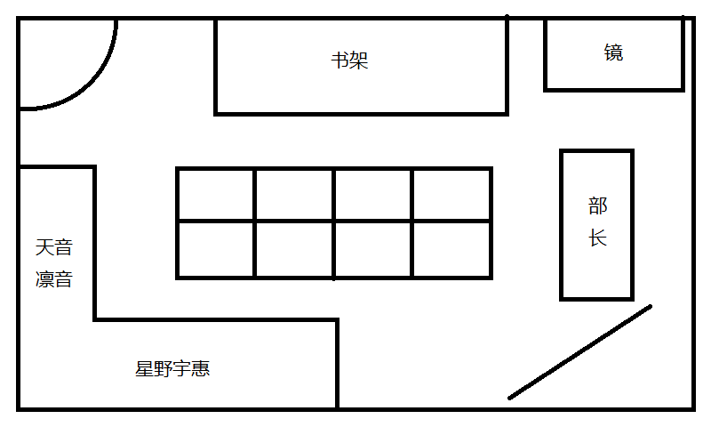

# <center>Code Girl</center>
<center>Lunex Nocty</center>

[toc]

## Prologue: Catalan Sequence

### 代码少女的日常

问题 0
>给定$n$个矩阵($n>0$)：$A_1,A_2,\cdots,An$，其中$A_i$与$A_{i+1}$是可乘的，$i=1，2...，n-1$。对于表达式$A_1A_2\cdots A_n$，有多少种不同的计算顺序？
当 $n=2$ 时，有且仅有 1 种计算顺序。
当 $n=3$ 时，有
$$\begin{aligned}
A_1A_2A_3 = ((A_1 \cdot A_2) \cdot A_3)\\
          = (A_1 \cdot (A_2 \cdot A_3))
\end{aligned}$$
共 2 种计算顺序。
当 $n=4$ 时，有
$$\begin{aligned}
A_1A_2A_3A_4 = (A_1 \cdot (A_2 \cdot (A_3 \cdot A_4)))\\
             = (A_1 \cdot ((A_2 \cdot A_3) \cdot A_4))\\
             = ((A_1 \cdot A_2) \cdot (A_3 \cdot A_4))\\
             = ((A_1 \cdot (A_2 \cdot A_3)) \cdot A_4)\\
             = (((A_1 \cdot A_2) \cdot A_3) \cdot A_4)
\end{aligned}$$
共 5 种计算顺序。
特别的，当 $n=1$ 时，有 1 种计算顺序。
PS：答案可能很大，请将答案对 $10^9+7$ 取模。

凛音静静的看着眼前这道题目，陷入了沉思。

这里是枫落学院代码社，如你所见，凛音现在正在进行社团活动中。

凛音对这个看似简单的题目毫无头绪，设当有$n$个矩阵时的有$C_n$种不同的计算顺序，目前知道的是$C_1=1, C_2=1, C_3=2, C_4=5$或许多写几个能发现规律？凛音这么想着，当$n=5$时，凛音拿起自动笔开始在草稿纸上列举。
$$\begin{aligned}
A_1A_2A_3A_4A_5 = (A_1 \cdot (A_2 \cdot (A_3 \cdot (A_4 \cdot A_5))))\\
                = (A_1 \cdot (A_2 \cdot ((A_3 \cdot A_4) \cdot A_5)))\\
                = (A_1 \cdot ((A_2 \cdot A_3) \cdot (A_4 \cdot A_5)))\\
                = (A_1 \cdot ((A_2 \cdot (A_3 \cdot A_4)) \cdot A_5))\\
                = (A_1 \cdot (((A_2 \cdot A_3) \cdot A_4) \cdot A_5))\\
                = ((A_1 \cdot A_2) \cdot (A_3 \cdot (A_4 \cdot A_5)))\\
                = ((A_1 \cdot A_2) \cdot ((A_3 \cdot A_4) \cdot A_5))\\
                = ((A_1 \cdot (A_2 \cdot A_3)) \cdot (A_4 \cdot A_5))\\
                = (((A_1 \cdot A_2) \cdot A_3) \cdot (A_4 \cdot A_5))\\
                = ((A_1 \cdot (A_2 \cdot (A_3 \cdot A_4))) \cdot A_5)\\
                = ((A_1 \cdot ((A_2 \cdot A_3) \cdot A_4)) \cdot A_5)\\
                = (((A_1 \cdot A_2) \cdot (A_3 \cdot A_4)) \cdot A_5)\\
                = (((A_1 \cdot (A_2 \cdot A_3)) \cdot A_4) \cdot A_5)\\
                = ((((A_1 \cdot A_2) \cdot A_3) \cdot A_4) \cdot A_5)
\end{aligned}$$

哇啊，竟然有多达14种组合，凛音放弃了继续写下去的想法，她很怀疑一页草稿纸能否列举完，而且也无法保证出错的可能性，但在写这些式子的过程中，她也确实感受到了某种规律性，既然有规律那么就应该有式子，现在要做的是把规律完全地找出来。

凛音注意到，当$n=5$的时候，有一些模式在重复的出现，但她还未能抓住那一闪而过的灵光，直觉告诉她，这个题或许是一个递归的结构，想到这里，她尝试对14种结果进行分组，如果仅关注最后一次运算的话，可以将结果分为4组，即：

$$\begin{aligned}
A_1A_2A_3A_4A_5 = ((A_1) \odot (A_2 \cdot A_3 \cdot A_4 \cdot A_5))\\
                = ((A_1 \cdot A_2) \odot (A_3 \cdot A_4 \cdot A_5))\\
                = ((A_1 \cdot A_2 \cdot A_3) \odot (A_4 \cdot A_5))\\
                = ((A_1 \cdot A_2 \cdot A_3 \cdot A_4) \odot (A_5))\\
\end{aligned}$$
PS: $\odot$用于表示出最后一次的乘法运算。

嗯？似乎发现了什么，在刚才写式子时就注意到的重复的模式，在这里被挖掘了出来。$A_2A_3A_4A_5$的计算顺序不正是当 $n=4$ 时的计算顺序吗？凛音用式子表示这个关系：

$$C_5 = C_1C_4 + C_2C_3 + C_3C_2 + C_4C_1$$

验算一下，$1\times5 + 1\times2 + 2\times1 + 5\times1=14$，嗯，完全正确，凛音觉得自己抓住了关键，将这个式子拓展到 $n$，那么就像下面这个样子。

$$\left\{
\begin{aligned}
C_1&=1 \\
C_n&=C_1C_{n-1}+C_2C_{n-2}+\cdots+C_{n-1}C_1, n>1
\end{aligned}
\right.$$

再来验证一下。
$$\begin{aligned}
C_2&=C_1=1\\
C_3&=C_1C_2+C_2C_1=2\\
C_4&=C_1C_3+C_2C_2+C_3C_1=5
\end{aligned}$$

嗯，到目前为止都很完美！那么接下来就是编码的环节了，凛音花了二十多分钟进行编码和调试，最终用写了一个递推版本的代码([code 0-1](https://github.com/lunexnocty/CodeGirl/blob/master/Code/code.0-1.cpp))，估计了一下这个程序的复杂度，是$O(n^2)$，她立刻在社团内部的在线判题网站上提交了自己的代码，随着一组又一组数据的通过，凛音的心也悬了起来。大概五秒后，最终结果出来了，一个大大的红色的TLE(Time Limited Error)出现在凛音的视野里，她知道这个题目又未通过。

带着不甘心凛音查看了详细的测试情况，一共100组测试数据，这份代码却只通过30%的数据，连一半的数据都没能通过。

这样的结果出乎凛音的预料，因为她实在想不通还有别的算法可以进一步降低算法的复杂度。

由于这是一个递推的式子，第一层循环避无可避，所以重点在于第二层循环吗？但是递推式就是这个样子的啊，只能继续深入这个递推式的特点，很显然，等号右边一共有$n-1$项，且每一项的下标之和都等于左边的下标 $n$，从 $C_1$ 计算到$C_{n-1}$，嗯？中间是不是有重复计算的？第一项和最后一项是一样的，只是交换了乘法的顺序，随着$n$的增大，重复计算的也会增多，而这部分多余地计算完全可以省略掉。

于是凛音很快对自己的代码进行了改进，在本地测试都通过了之后，提交了第二版的代码([code 0-2](https://github.com/lunexnocty/CodeGirl/blob/master/Code/code.0-2.cpp))。很快，结果再一次出现在凛音的眼前。

又是一次TLE，查看详细，这一次通过了45%的测试数据，看来这种程度的优化还是没法通过这个题。还能继续优化？凛音仔细打量着这个递推公式，确信没有其他的地方存在重复计算的情况了。看来无法利用这个递推公式解决这个问题吗，她如此想着。如果递推公式还不足以解决这个题目的话，那么就进一步，求出这个数列的通项公式如何？如果能获得$C_n$的通项的表达式，说不定可以在$O(1)$的时间复杂度内解决这个问题！凛音有些乐观的想着。

凛音对数列的了解仅限于等差数列与等比数列，所以尽管很努力的思考了，却依旧没有什么进展，直到校园的铃声打乱了她的思绪，凛音这才注意到，已经五点三十分了。

枫落学院的社团活动从下午三点半开始，五点半结束，到六点之前所有人必须离开学校。这一点和其他学校并没有什么不同。

该回去了，想到这里，凛音拿出自己的笔记本，把电脑上的题目抄到了最新的一页，还把之前得出的递推式写在了下面，并写上了求通项的提示，然后将作为书签用的丝带夹在那一页，装进了包里。关注了一下活动室的其他人，部长正在和水野镜同学聊些什么，之前都没注意到呢，想着这些无关的事情，一边向她们告别，一边向着门口移动。

「部长，水野同学，我先走一步」

也没有等待对方的回应，径直离开了活动室。

凛音一边思考着怎样求通项，一边一层层的走下楼梯，自然没有注意到视线之外的余裕，突然一股茶叶的清香传来，还未意识到什么，一股力瞬间将她推到在地上，毫无准备的摔倒让她稍微露出了痛苦的表情，不过并没有什么大碍。

「对不起！你没事吧？」凛音听到一位女生的声音，原来刚才是撞到人了吗？

「没事」淡淡地回应之后，凛音抬头看去，是一位有着茶色长发的女生，明明不认识这位女生，却有种淡淡地熟悉感，总觉得在哪儿见过的感觉，注意到领带的颜色，果然是一年级的。

「我来帮你捡」

凛音这才注意到，两人的书都散落在地上，立刻和对方一起慌忙的收拾地上的东西。

「这就是全部了」茶发女生将最后一本书放到凛音手上，静静地看着她。

「谢谢」凛音仅仅是保持着最基本的礼貌向面前这位陌生的同学道了谢，然后就打算直接离开，对方似乎还有什么话要说的样子不过凛音并没有在意。

匆忙别过的两人，丝毫没有注意到，一模一样的笔记本，已然被悄无声息的交换了。

<div style="page-break-after: always;"></div>

### 放学路上

从办职员室里出来，已经是傍晚了，社团活动也差不多该结束了吧。果不其然，刚出门不久，铃声便响了起来，待到这么晚，进入高中之后还是第一次。今天叫我过去的是我的数学老师——藤原敬太(ふじわら けいた)，今天叫我过去似乎是为了确认我的数学成绩，在职员室做完了一套颇有难度的试卷之后，似乎是得到了他的认可才终于放我回家。

我所在的高中——枫落高中在沧海县当地是一座以学力而闻名的私立高中，说到枫落高中，据说其名字还有着一段故事，不过我并不太关心这种事情，所以并不是很清楚其中的细节，而我来到这所高中的目的，则是这所高中那令人安心的升学率。

作为在当地升学率最高的高中，其入学考试的难度自然可想而知，能通过的自然是原来学校中的佼佼者，心中难免有一些傲气，老师们的应对方法也很简单，便是在入学之后的第二周，组织了一场全校规模的大考——开学考，不但题目颇有难度，而且其成绩也会被记录在学生的档案之内。其目的自然是摸清学生们的真实学力，对于二三年级的学生来说，是对假期之后学生们是否松懈的检验，但对于一年级的新生来说，不免多了一层警告之意，向好不容易才考入枫落高中的新生们传达「你们目前的学力离枫落高中的要求还差得远呢！」这样的含义吧。大考之后，枫落高中的老师们预想之内的低分对于原学校的佼佼者们来说难免是一场打击，冲淡了考入枫落高中的骄傲，留下的则是不甘，将这种不甘化为学习的动力，或许正是老师们打着的如意算盘吧。

回到我被藤原老师单独留下的问题，自然与这次大考有关，在这次大考中，我——星野宇惠(ほしの うえ)，是在这次的考试中，唯一拿了满分的人。对于满分当然要慎重对待，于是在成绩发布之前，藤原老师便找到了我，希望我能证明我确实有拿满分的实力，而证明的方法也很简单，再做一套难度与开学考相仿的试题便是，由于是临时出的题目，自然也没了作弊的可能，其结果似乎令他相当满意。因此在我完成试卷，他也确认了答案之后，藤原老师很干脆地放我离开了。

虽然对被强行留校到现在有点怨言，但我也没办法向老师直诉不满，便也只能作罢。正巧这时响起了社团活动结束的钟声，让我想起了我还有一位参与社团活动的友人或许现在还没有回家，自从她加入社团之后，一起回家什么的，便再也没有过了，想到这里，难免升起了一股和我那位友人一起回家的冲动，我便稍微饶了绕路，没有直接离开教学大楼前往校门，而是一边思考怎么应对我的友人，一边思考着学校的平面图，往东边的社团大楼移动。

.png)
<center>图0-1 学校俯视图</center>

东边的社团大楼的两个出口分别设在大楼的东西两侧，开口自然是面向运动场的北方，来到了社团大楼的侧面，左边就是运动场，右转就是社团大楼的靠仅西边的出口，心思没在状态的我自然没有考虑到现在社团活动刚刚结束，正是人流量最大的时候，而毫无准备的我自然也不会料到正好有位同学刚结束了社团活动而从楼梯口出来，然后两个人完美的撞在了一起。

或许是对面正打算转弯的关系，总之对方没能把握住平衡而向后摔倒在地，我则勉强保没有倒下，这得以给了我打量对方的时机。映入眼帘的，是一头漂亮的黑色长发，只有一个简朴的发带稍微束住了两鬓的头发，让整个人看起来要精神了一点，胸前绿色的领带则表示眼前的这位同学和我一样是一年级新生，脸上则是有些痛苦的表情，看起来应该是摔倒屁股了，看起来很疼的样子。

「对不起！你没事吧？」

虽说是两个人撞在一起了，但就结果而言对方受到的伤害更大，就道理而言我也应该靠左行，所以这一起事故的责任可以说几乎都是我的责任，我自然没有推卸的打算。

「没事」疼痛似乎有些缓解，对方也完全没有继续追究的意思，虽然语气有点冷漠。这让我有点安心，要是对方非要追究的话我却并不擅长那种场面，到时候怕是只得求助于我的友人来调解，但我向来是不愿意欠别人人情的，因此倒是对眼前的女生平白多出了几分好感。她坐在地面上没来得及起身，我便主动请缨收拾二人的散落在周围地面上的东西，主要是书籍，笔记本还有手帕钱包等杂物。

「我来帮你捡」说着的时候，便已经蹲下去了，两人的东西完全混在了一起，好歹我对自己的东西有着充足的印象，倒不至于拿错。对方似乎也意识到了，也忍着疼痛迅速站起来帮我一起收拾。

「这就是全部了呢」我把最后一本笔记交到她手上，想着作为赔礼下次要不要请她喝杯茶呢什么的。

「谢谢」然而事与愿违，我还没来得及表示我的想法，她便急匆匆地离开了，没有一丝的逗留，难道有什么急事吗？

就算想也想不明白，只好把这件事情抛在一边，把我自己的东西放进书包里，稍微往左边靠了靠，不至于再一次发生撞到人的惨剧，观察着来往的行人。

无论是从西边楼梯下来的，还是从东边楼梯下来，然后从走廊过来的学生，大多都是两三人一起，鲜有单独一人的，这倒是让独自在走廊等待的我有些显眼，我从来就不善于暴露在人的目光之下，等待的时间也因此显得有些难熬，我便也趁此机会思考起我所等待的这位友人所参加的社团。

枫落高中虽说是以学力著称的升学高中，但这并不意味着社团活动就毫无活力，正相反，由于招收的学生大多是个初中的佼佼者，社团活动更显得丰富多彩，学校似乎对社团活动也颇为支持，无论是在校规上还是在经费上都极为支持社团的发展，而学校确实也有几个称得上有名气和历史的社团，比如文学社，化学社，篮球社，足球社等，但据我所知我的友人并没有加入这些颇有实力的社团，而是加入了一个似乎由于人数不足而面临废部危机的社团，具体的社团的名字我并没有特意去记住，唯一有印象的是社团只有一位三年级的前辈和两位一年级的新生，三年级的前辈很少姑且可以强行解释为升学的压力，但二年级的前辈一个也没有就很值得推敲了，由于社团目前还没有废部，所以在一年级的两位社员加入之前社团是切实存在的，也就是说社员人数必然是不少于5人的，所以这学期开学后，剩下的4名社员去哪儿了？三年级的话可能是迫于升学的压力不得不离开，那么二年级呢？总不能上一届完全没有招到新社员吧？因此我倾向于社团发生了什么事情导致大量社员退社，才导致了废部的危机，至于具体是什么事情，便不是我能推究的了，可能是新任命的部长不受待见吧，虽说只是毫无根据的推测，却也让我对这位素未谋面的三年级前辈产生了些许芥蒂，同时对在这个时期入社的一年级新生产生了好奇。其中一位自然就是我的友人，她那面对任何新鲜的事物的好奇心而做事不经大脑的行动很可能因为一时冲动而入部，另外一位便不好说了，或许我的友人会找个时机引荐给我也说不定。

心中想着些有的没的，倒也缓解了我独自一人等待在走廊的尴尬，不一会儿，一个熟悉的的声音将我从我的思绪中解放了出来。

「啊嘞？宇惠？为什么会在这里？」我将视线投入到声音的源头，熟悉的金发双马尾显示着她的身份，我所等待的友人——水野镜(みずの かがみ)，从初中开始就是同学，最后勉勉强强和我一起考进了枫落高中，算得上是我最好的朋友。镜的声音听起来有些惊讶，毕竟我没有加入任何社团，现在这个时候还留在学校的确出乎她的意料，我也注意到镜并不是单独下来的，在旁边陪着她一起的应该就是社团现任的部长，那位三年级的前辈，告诉我答案自然就是那胸前的紫色领带，这位前辈有着咖啡色的长发，和之前不小心撞到的人不同的是，并没有束起来，而是自然的垂下，刘海附近别了几颗发夹防止眼睛被遮住，拜此所赐我能很方便的看清这位前辈的容颜，单从外表而论绝对担得上美人这个称呼。

「您好(御機嫌よう)，前辈，我是一年级的星野宇惠，水野镜同学的朋友，初次见面，请多关照。」由于前辈在场，自然不能失了礼数，虽说因为刚才的胡思乱想让我对这位前辈并没有太好的印象，但终究不能表现出来，免得前辈由于我的缘故而对镜留下不好的印象。

「不用那么礼貌也可以哦，星野同学，我是代码社的部长，小宫夜羽(こみや よはね)，既然是星野同学是特意来等小镜的，我也不便打扰，那么，小镜，我先走了」前辈似乎并不是特别看重礼数，也很适宜的和镜告别，看起来，似乎是为不错的前辈，不像是那种会招致怨恨的人，这让我对这个社团二年级消失之谜产生了更多的疑问。从对镜的称呼来看，短短一两周和镜的关系便已经如此之好，不知是镜更加主动还是两人确实投缘。总之这一次见面倒是一改之前我对小宫前辈的印象，我也在心中为之前对小宫前辈不好的想象而道歉。

「啊，夜羽学姐，再见！」镜似乎才从惊讶中恢复过来，连忙向前辈道别，不过礼数却并未到位，不过我已经知道小宫前辈对礼数并不是非常在意，而且这么久前辈也应该知道了镜的性子，我也懒得去纠正什么了。随后夜羽前辈便离开了，我以为她会顺着人流径直回家，结果我又一次猜错了，她去了教学楼周围停放自行车的区域，看来是骑自行车上下学的。在我打量着夜羽前辈的时候，镜已经来到了我面前。

在先用书包碰了我一下，确认我将注意力转移到她身上之后，才开启话题问道，「宇惠今天怎么会在这里等我？」脸上满是好奇，一个放学了就立刻往家里跑的人为什么会等上两个小时之久，要说是专门等她的话镜是万万不信的。

由于在走廊并不是什么说话的好地方，我示意镜我们边走边说，两人并肩走在了回家的道路上。

「今天放学后被藤原老师叫过去了」面对升上高中后唯一的友人，我也并没有隐瞒的必要。

「藤原老师就是那个教数学的那个？真的是年轻又帅气，在我们班引起了不小的骚动呢！呐呐！到底是因为什么事情叫你过去啊？真好啊，我也想和帅气的藤原老师单独相处呢~」原来藤原老师这么受欢迎吗？

「就算是被强制在教职员室做了两个小时的试卷？」

「欸？那是什么？可怕……」镜大概在脑海中想象了一下，立刻露出了嫌恶的表情，心中对藤原老师的评价大概下降了不少，学生，终究是讨厌考试的，特别是这两天刚大考结束，而镜爱玩的性子注定不会对考试产生好感，镜停顿了一下，接着问道，「宇惠的数学成绩很不错吧，为什么会被单独叫过去啊？」

「大概是上次大考我拿了100分。」

「……能一脸平静的说出拿了100分这样的事实，在某种意义上比拿了满分还要厉害……欸？上次的大考？开学考？那不是超难的考试吗？数学那一科的题目我都看不懂，你到底是何方神圣！」

面对开始耍宝的镜我不禁莞尔，对藤原老师的不满随着镜的声音一起消失在沧海县的街道。

「普通的高中生啦！」我也顺着氛围敲了镜的头，只见她夸张的双手抱头，蹲在地上向上看着我。

「好过分……」这样拙劣的演技自然骗不过与她熟识的我，我便不再理睬她，而是直接从她旁边走过，心中则提防着有可能出现的恶作剧，果不其然，我刚走过她身边，一之手就抓住了我的裙子，虽说我早有提防，可总就是敌不过镜的速度。我只好站在原地，看着她抓着我的手站了起来，我则是尽力摆出一副生气的样子，要是我的裙子在公共场合不小心被扯掉了，对于女孩子来说真是难以想象的地狱。

或许是看出了我脸色有点黑，镜也适时地收起了玩笑，「抱歉抱歉，谁让你打算丢下我的。」完全看不出有反省的样子，不过刚才我确实有丢下她的打算，便也只得作罢。在收下了镜作为赔礼送给我的可丽饼之后，话题转移到了镜的社团。

「社团活动？嗯，做有趣的游戏？」镜歪着头思考道，「什么什么？宇惠终于对我们社团产生兴趣了吗？要加入了吗？」并不会哦，辜负了你的期待真是抱歉，由于刚刚收下镜的可丽饼，我并没有直接说出来，而是问起了其他的东西。

「那镜加入社团的契机是什么？」

「说到这个，宇惠你知道有个叫做『枫落吴江』的app吗？啊，我忘了宇惠没有智能机。」后知后觉的镜靠近了我，展示她的手机给我看，点击了一个有着枫叶图标的程序，一边操作一边介绍道，「这个app就是我们代码社制作的，虽说实际制作的只有夜羽前辈一个人啦，去年的时候发布在网上的程序，是一个校园社区的程式，里面介绍了大量枫落高中的校园信息，包括学校介绍，社团介绍，教师介绍等对新生来说非常有用的信息，而且还有自媒体平台，还可以在上面发贴，聊天等，总之是一个非常实用的app，但是唯一的缺点，嘛，你也看到了，界面太难看了，要是能配上更加可爱一点的背景的话肯定能更受欢迎的吧。」诚然，正如镜所说，这个app的界面确实不怎么好看，对这个注重产品外观的时代想必用户也不是特别的多吧。不过，原来镜加入的社团叫代码社啊，我倒是没办法从名字看出来是个怎样的社团呢。

「确实是个很有用的app，但仅凭这样就能让你加入这个社团？」对于镜的好玩的性子我是深有体会，断然不会仅凭这个app就让她放弃其它社团的诱惑，因此一定还有什么决定性的事物。

「欸嘿嘿，不愧是宇惠。」镜打开了程序中的小程序界面，出现在眼前的则是好几款小游戏，每一款游戏还有一个排行榜，一个id名叫『Mirror』的用户在每一款小游戏的牌名都颇为靠前，想必那便是镜在这个社区的id吧。排行榜的用户并不多，倒是不能看出镜的游戏水平怎么样，但也为解答我小镜为何会加入这样一个社团的疑问。

「这里面的游戏都非常的有趣，我对游戏的制作者也是十分的倾佩，所以就带着我能不能也做出有趣的游戏呢的想法，然后就按照这个app提供的地址去了代码社，当时部长很明确的告诉我，只要去做，就可能做到，但如果不去做的话，就一定没可能做到。」我想着这种正确的废话估计也只有镜才会上当了吧，镜模仿着夜羽前辈的语气，「『如果你真的想做出好玩的游戏的话，我会从基础开始一点一点教你的，所以请尽情的加油吧！』，被那样说了的我就顺势加入了社团，就结果而言，果然作游戏还是太难了，宇惠要是一起的话绝对会轻松许多的。每天都在社团不停的学习学习，回到家还要应付老师们留下的作业，这样下去迟早有一天会被榨干而亡的，到时候我一定会把错误归结到宇惠的头上，每天晚上都去敲宇惠房间的窗……」不知不觉就变成了诉苦大会，而且有着做鬼也不放过我的趋势，我立刻打断了镜的自我演绎，虽说我对怪力乱神什么的向来嗤之以鼻，但世界之大无奇不有，面对大自然还是要保持最基本的敬畏之心，所以趁话题向着鬼故事发展之前终结这个话题。

女子高中生之间总有讲不完的话题，特别是进入了一所新的高中，我和镜也在不同班的情况下，我们分享着各自在学校的见闻，不知不觉就回到家了。

<div style="page-break-after: always;"></div>

### 在家中解生成函数

久违的和朋友一起回家，感觉确实很不错，至少我现在的心情是非常开心愉快的，洗完澡，吃过晚饭，回到房间之后，已经是晚上七点半了，将心中的愉悦抛出脑海，开始完成今天的作业。

由于前两天的大考，老师们也都忙着批改试卷，所以留下的作业非常少，今天也是只有国语，英语和化学的作业，花了不到一个小时的时间处理完所有的作业之后，不免有些无所事事，出去泡了一杯热茶之后，也终于决定了接下来的计划，从包里拿出我的笔记本开始预习明天的功课。虽说在理科方面颇有自信，但国语向来是我最为薄弱的学科，这份缺陷在枫落高中或许会被成倍的放大吧，带着这样的危机感我同时翻开了课本和我的笔记本。

「嗯？」笔记本上记录的内容却并不是我在课堂上留下的笔记，而是一道说法有些奇怪的题目，面对这种预料外的事实大脑一时有些宕机，这道题目倒也因此给我留下了比较深刻的印象。

欸……？不是我的笔记本？

我面前的，是和我的那本笔记本的封面一模一样的笔记本，为了确认，我翻到第一页，上面用清晰的字迹显示着一个陌生的名字——天音凛音(あまね りんね)

一年D班，和镜同样的班级。

脑中立刻浮现出傍晚和我相撞的那位黑发的女生。我向来没有拿别人东西的习惯，我在班上也没有走的足够近的朋友，最后可能发生问题的环节，只能是今天下午的那一场事故，所以，这个笔记本的主人，毫无疑问应该就是那位身高有些矮小的黑发女生了吧。以防万一，我还是先和镜确认一下比较好。我来到客厅，用家里的座机拨通了镜的手机，很快，镜的声音出现在话筒。

「你打断了我的学习！」我自然是不信的，她只会因为有借口而得以短暂地逃离学习而感到高兴，所以我更倾向于她现在正在玩游戏，而被我的电话打断了。

「反正又是在玩音游吧，你也不担心被水野阿姨发现，我打电话给你是有事情想问你，你们班上是不是有一位叫天音凛音的学生？」

「欸？你怎么知道？」看来没错了，我只好把我撞倒天音同学，随后又不小心拿错了笔记本的事情原原本本告诉了镜。

「一样的笔记本……一样的笔记本……」镜似乎对于我和天音同学用着一模一样的笔记本一事很是在意，不过现在的问题是天音同学是个怎样的人，我该怎么把笔记本还给她。

「镜，你对天音同学的认识有多少？知道她家住哪儿吗？」

「天音同学正是我们代码社的第三名成员哦！」欸？这么巧？我心中感叹了下人与人之间的巧合，继续听着镜的描述。「虽然我们在同一个班也在同一个社团，但我和她聊天的次数着实不算多，她总是一个人呆着，沉默寡言，在教室也很少和人说话，下课了也没见她和朋友聊天，社团活动倒是从来没有缺席过，但也是一个人坐在角落里努力，在编程方面有着不小的实力，很少需要学姐的指导，夜羽学姐似乎也很看好她，总体来说是个有些奇怪的人，我也没能顺利的和她成为要好的朋友，住址什么的，当然不知道了。那个笔记本我知道，是那个有着星空图片封面的笔记本吧，当时我就想着宇惠可能会喜欢，没想到你居然真的有一个。天音同学的那个笔记本主要记录的是自己在社团活动中遇到的不会的题目，虽说上课时用不到，不过对于天音同学来说还是挺重要的。」

镜的描述和我今天看到的天音同学大致还是非常吻合的，话很少，有点冷漠和镜这种外向的人简直是两个不同的极端，但为人礼貌，心胸也很宽广，而且似乎还是一位努力的人。我向来是不吝于向努力的人献上敬意，我对天音同学的评价又高了几分。

「那只好我明天课间去交给她了吗。」我低声呢喃着，暗自做了打算。

「明明直接拜托我交给她就好了，就对天音同学那么感兴趣吗？」镜还是听到了我的低语，一时之间我竟也有些慌乱。

「亲手交给她才能显示我的诚意吧，好了，我不打扰你学习了，请加油学习！」无视了镜试图挽留以延长面对作业的时间的打算，我挂掉了电话，镜真是，在这种方面意外的敏锐，我确实有想更多的了解天音同学这个人的想法，不仅是第一次见面的好感和刚才镜对她的描述，还包括了眼前的笔记本，上面记录的那一道题目。

>$$\left\{
\begin{aligned}
C_1&=1 \\
C_n&=C_1C_{n-1}+C_2C_{n-2}+\cdots+C_{n-1}C_1, n>1
\end{aligned}
\right.$$
求$C_n$的通项公式。

上面用规范的字迹写下了一个关于矩阵连乘的不同顺序的个数问题，以及我所关注的，天音同学所得到的关于${C_n}$的递推式，以及求通项的提示。数列这个东西自然是不陌生的，虽说数列并未纳入初中数学的教学大纲，但为了应付枫落高中的入学考，不少以枫落高中为目标的学生都对数列有着最基本的认识，等差数列和等比数列更是必考的考点，自然不会有太大的问题，但看这个递推式的形式，显然并不是简单的等差数列或者等比数列，想要用初中的知识去解决这个问题，无异于有些难度，我自认为数学在同龄人之中还算出众，便有了挑战这个题目的心思。

简单验证了天音同学给出的递推式无误之后，我拿出草稿纸开始了进一步的推导。

首先关注这个递推式的形式，$C_n=C_1C_{n-1}+C_2C_{n-2}+\cdots+C_{n-1}C_1$，用 $\sum$ 表示的话就是这样，$C_n=\sum\limits_{k=1}^{n-1}C_kC_{n-k}$，显然是卷积的形式，很难直接通过对递推式的变形来求解，这个时候或许需要借助一下生成函数这个工具了。

定义函数$C(x)$

$$C(x)=\sum\limits_{k=1}^{\infty}C_kx^{k-1}$$

嗯？感觉不太好看，稍微修改一下吧。

$$C(x)=\sum\limits_{k=0}^{\infty}C_kx^k$$

为了让式子更加富有美感，我把$C_0$当作数列的第一项，最后只需要做一个简单的转换就好了。

看到卷积，那么，考虑对$C(x)$平方，可以得到

$$C^2(x)=(C_0C_0)+(C_0C_1+C_1C_0)x+(C_0C_2+C_1C_1+C_2C_0)x^2+\cdots$$

进行一般化，$x^n$的系数是多少呢？我不停的计算着，脑子里只剩下了眼前的式子，取不同的组合，再将$x^n$的系数加起来……啊！眼前的式子让我很惊喜。

$$\begin{aligned}
&\quad C_0C_n+C_1C_{n-1}+\cdots+C_kC_{n-k}+\cdots C_{n-1}C_1+C_nC_0\\
&=\sum\limits_{k=0}^nC_kC_{n-k}
\end{aligned}$$

它正好是$C_n$的递推式，于是，$C^2(x)$就可以很简单的表示为

$$C^2(x)=\sum\limits_{k=0}^{\infty}C_{k+1}x^k$$

那么，接下来的操作就很顺理成章了。

$$\begin{aligned}
xC^2(x)-C(x)=&\sum\limits_{k=0}^{\infty}C_{k+1}x^{k+1}-\sum\limits_{k=0}^{\infty}C_kx^k=-C_0\\
&xC^2(x)-C(x)+C_0=0
\end{aligned}$$

由于修改了初始定义，使$C_0=1$，代入其中直接可以求解

$$C(x)=\frac{1\pm \sqrt{1-4x}}{2x}$$

咦？出现了两个解？我们知道$C_0=1$，所以$C(0)=1$，由于分母不能为零，于是求$\lim\limits_{x\to0}C(x)$

$$\lim\limits_{x\to0}\frac{1+\sqrt{1-4x}}{2x}=\infty\\
\lim\limits_{x\to0}\frac{1-\sqrt{1-4x}}{2x}=1$$

取正根时，函数甚至不收敛，显然这里保留负根，于是得到$C(x)=\frac{1-\sqrt{1-4x}}{2x}$。

呼~似乎完成了什么重大的事情一样，我长长地呼了一口气，接下来的步骤就比较容易了，在此之前我决定先喝一杯茶再继续。

小小的抿了一口才意识到茶杯中的茶都凉了，我只好起身去客厅续了一杯热茶。

喝了一口热茶，回到了书桌，继续未完成的作业。

接下来要做的事是将$C(x)$进行泰勒展开，然后通过比较系数来得到$\{C_n\}$的通项，直接对$C(x)$求导？略微思考一下就会发现这个工作量太过巨大，而且求导的目的是为了泰勒展开获得$x^n$的系数，这种复杂的函数求导很难对系数进行一般化。

提前将直接泰勒展开的思路掐灭掉之后，我开始考虑另外的方法。

将式子变形看看。

$$\begin{aligned}
2xC(x)&=1-\sqrt{1-4x}\\
2x\sum\limits_{k=0}^{\infty}C_kx^k&=1-\sqrt{1-4x}\\
2\sum\limits_{k=0}^{\infty}C_kx^{k+1}&=1-\sqrt{1-4x}
\end{aligned}$$

好像可行！那么，定义函数$f(x)=\sqrt{1-4x}=\sum\limits_{k=0}^{\infty}F_kx^k$，由于$f(0)=1$，所以$F_0=1$，带入前面的式子的话

$$2\sum\limits_{k=0}^{\infty}C_kx^{k+1}=1-F_0-\sum\limits_{k=1}^{\infty}F_kx^k=-\sum\limits_{k=1}^{\infty}F_kx^k$$

直接比较$x^n$的系数，可以得到

$$C_n=-\frac{1}{2}F_{k+1}$$

前路逐渐变得明朗起来，接下来只需要求出$f(x)$的在$x=0$处的展开式就可以了，已知泰勒展开式

$$f(x)=\sum\limits_{k=0}^{\infty}F_kx^k=\sum\limits_{k=0}^{\infty}\frac{f^{(k)}(0)}{n!}x^k$$

反复的对$f(x)$进行微分

$$\begin{aligned}
f(x) &= (1-4x)^{\frac{1}{2}}\\
f'(x) &= -2\cdot(1-4x)^{-\frac{1}{2}}\\
f''(x) &= -2\cdot2\cdot(1-4x)^{-\frac{3}{2}}\\
f^{(3)}(x) &= -2\cdot4\cdot3\cdot(1-4x)^{-\frac{5}{2}}\\
f^{(4)}(x) &= -2\cdot6\cdot5\cdot4\cdot(1-4x)^{-\frac{7}{2}}\\
&\vdots\\
f^{(n)}(x) &= -2\cdot\frac{[2(n-1)]!}{(n-1)!}\cdot(1-4x)^{-\frac{2n-1}{2}}\\
f^{(n+1)}(x) &= -2\cdot\frac{(2n)!}{n!}\cdot(1-4x)^{-\frac{2n+1}{2}}
\end{aligned}$$

得到$f^{(n+1)}(x)|_{x=0}$的值为

$$f^{(n+1)}(0)=-2\frac{(2n)!}{n!}$$

很自然的得到$F_{n+1}$的值为

$$F_{n+1}=\frac{f^{(n+1)}(0)}{(n+1)!}=-2\frac{(2n)!}{n!(n+1)!}$$

至此，得到了$\{C_n\}$的通项公式，

$$
C_n = -\frac{1}{2}F_{n+1}=\frac{(2n)!}{n!(n+1)!}=\frac{1}{n+1}\frac{(2n)!}{n!(2n-n)!}\\
C_n=\frac{1}{n+1}C_{2n}^n,n\geq0
$$

正当我以为大功告成的时候，验算的时候却发现对不上，按照我算出来的通项，数列应该是$C_0=1,C_1=1,C_2=2,C_3=5,C_4=14,\cdots$，显然和天音同学写的递推公式不吻合，恰好错位了。

我只好再从头开始看我的推导过程。啊，原来是定义$\{C_n\}$的生成函数的时候为了形式的统一修改了定义，我还以为我中途算错了。只需要稍微修改一下下标就可以得到符合天音同学给出的递推式的通项公式。

我写下了我得出的结论。

$$\left\{
\begin{aligned}
C_1&=1\\
C_n&=\frac{1}{n}C_{2(n-1)}^{n-1},n>1
\end{aligned}
\right.$$

将结论写在了笔记本上，我不禁长长舒了一口气，这个题目的难度远超我的想象，如果不是有了解过生成函数这种就算是高中也极少用到的工具，或许我便会和天音同学一样对这个题目手足无措吧，不过，做完之后重新审视一边最开始的题目，我却察觉到了一丝违和感。题目的说法似乎有些奇怪，这个暂且不提，至少对于理解这个题目的意思没有影响，求的是有多少种不同顺序的个数，从表述上来看更像是一个排列组合类型的题目，而最后的通项也确实旁证了这一点，而排列组合则在高中的教学大纲范围内了，不至于像生成函数那么偏门，或许这个题有着其他的解法。

<div style="page-break-after: always;"></div>

### 另外一种解法

连喝了两杯茶，让我产生了一丝尿意，我带着空了的茶杯，到厨房洗干净之后暂时放到了客厅的茶几上，上了个厕所，顺便用冷水刺激一下有点发烫的脸，看了看客厅的挂钟，已经到九点二十几分，父母正在看电视，上面播放着青春连续剧，我倒是也好奇为什么步入中年的双亲会对这种类型的电视剧感兴趣，但我终究没能问出口，毕竟母亲的年龄问题不可提。

脑中仍旧环绕着刚才那个题目的另外一种解法，我觉得今晚上不做出来我可能是睡不着了，于是从茶几上拿出了一包茶叶，打算再给自己泡一杯茶。

「都这么晚了，你还要喝茶？这都第三杯了吧？」母亲的声音传来，果然是注意到了吗。睡前喝茶并不是什么良好的习惯，但一边喝茶一边思考数学题是我为数不多的乐趣之一，只有这点绝对不能让步。心中思量着应付母亲大人的质询，手上的动作却没有停下来。

「大概是今晚的料理有些咸了吧，所以今晚频繁口渴。」对不起，其实母亲大人的料理很好吃，但我总得给自己找个借口。

「真的吗？爸爸，今晚的料理真的有些咸了吗？」对自己的厨艺怀疑的母亲转而向父亲大人取证，然而父亲和我可是品茶的统一战线联盟，他自然明白我心中的小算盘，因此倒也没有戳穿，反而是赞同的点了点头，母亲大人因此陷入了自我怀疑的深渊，我得以顺利地带着泡好的茶回到了房间。

重新审视这个题目，由于已经走过了天音同学的思路，倒让我得以仔细推敲题目中的信息，题目需要我们求得的是不同计算顺序有多少种，而且还强调用括号来区分不同的运算顺序，我开始关注于表达式的符号的排列上，显然，对于$n$个矩阵相乘的表达式来说，总有着$n-1$对括号，$n-1$个乘法与$n$个矩阵，符号的总数和类别总是固定的，这给了我一种重新解释这个题目的思路——排列数。

由于括号总是成对出现，而乘号的位置和矩阵的符号也总存在着关系，如果我去掉所有括号的右括号和矩阵本身的符号，只保留左括号和乘号，能否唯一的确定一个计算顺序呢？于是我开始验证，当$n=3$的时候，去掉右括号和矩阵之后的符号串为 $((\cdot\cdot$ 和 $(\cdot(\cdot$ 。尝试去按照规则还原，果然，就算去掉了右括号和矩阵本身的符号，也不影响这个符号串表达的含义，这让我对这个方法的可行性增添了些许信心，至于为什么去掉的是矩阵本身的符号而不是去掉乘号，自然是因为乘号的数量比矩阵本身的数量少一个。

经过上述的整理和简化，现在的问题简化成了求$n-1$个右括号与乘号的排列问题，当然，对于一般化的问题，求关于$n-1$的表达式与求$n$本身的表达式之间并没有什么不同，无非就是初始条件的区别而已，因此，我再一次自作主张的修改了这个问题。

>求$n$个乘号与$n$个左括号的排列数。

当然，如果仅仅是这个程度的问题倒也不至于难道我，总共有$2n$个符号，也可以理解为$2n$个空位，要向其中插入$n$个左括号和$n$个乘号，从$2n$个空位中选$n$个方括号，答案可以直接写出来：$C_{2n}^n$，但其中存在着一些不符合要求的排列，需要我们剔除。现在的难点在于，如何才能找到哪些符合要求的排列，而哪些又是不符合要求的排列，找到这个标准才是这个问题真正需要思考的地方，而这个问题或许得回到问题本身去寻找答案。

正当我的思绪告一段落，正端起一口茶享受的时候，门口的敲门声适时地响起，从略有些急促的敲门声我判断出这是母亲大人在敲门，说了声请进之后，开门而入的果然是母亲。她知道我不喜白开水，手中端着的是一杯鲜榨的苹果汁。看到我手上端着的茶杯，果然开始了说教，「晚上喝太多茶容易失眠，对肠胃也不太好，你怎么就是不听呢。」我只好傻笑着试图萌混过关，母亲倒也没再追究，而是看向了我的草稿纸，开启了另外一个话题，「枫落高中学习压力虽大，但也没必要这么努力吧，升到高中了，有加入什么社团吗？有什么兴趣爱好的话我们也挺支持的。」可能是刚才看了青春连续剧的原因，母亲居然关心我的社团活动了，我自然是没什么想要加入的社团，对天文社倒是有些兴趣但半夜出去观星什么的自然不会得到允许，爱好喝茶却也达不到品茶的境界，如果加入茶道社估计会引起许多人的不满，枫落高中似乎也没有什么数学类社团，所以我完全没有加入任何社团的想法。对此我只好含糊其辞，说找到感兴趣的就会参加，母亲对我向来是很放心的，便不再多说，嘱咐我早点休息，顺便没收了我喝了一半的茶。

虽然茶没了，但该做的事情还得继续，我只好再一次翻开了天音同学的笔记本，从题目中寻找有助于我解题的信息。我通过去掉右括号和矩阵符号，得到了一个符号串，那么，这个符号串是可以还原成原来的式子的，那么，是不是对于所有的排列都能还原呢？我只好运用其最原始的方法——列举法。

为了使列举的数量不至于太大，我选择了两个左括号和两个乘号，将它们的全排列一一写在了草稿纸上：
$$
((\cdot\cdot \quad (\cdot(\cdot \quad (\cdot\cdot( \\
\cdot\cdot(( \quad \cdot(\cdot( \quad \cdot((\cdot 
$$

通过好几次尝试，能还原出合法的表达式的只有前两个排列，后面的4种排列却怎么都没办法还原出一个可计算的表达式。所以，只需要排除掉不能还原的排列就可以了。能够还原的排列有着什么特征呢？这个问题在我之前尝试还原的时候就隐隐明白了，后面的4种排列，在添加右括号的时候总有不少于一个乘号落在了括号外面，而前两个刚好能把所有的乘号都放进括号里，一个可计算的表达式的所有乘号肯定只能在括号里面。为了进一步寻找到这个可计算的条件，我每添加一个 $)$ ，便把 $(\cdot)$ 直接去掉，去掉这种说法有点模糊，更严格的说法是，将 $(\cdot)$ 替换为空串，合法的排列总能不停地利用右括号将 $(\cdot$ 替换为空串。这样，我每添加一个右括号，就可以计算一次，如果整个排列是可计算的，那么最后一定可以得到一个空串！我把可以得到空串的排列称为可消的符号串，所以问题变成了求求$n$个乘号与$n$个左括号的排列中，可消的排列有多少种。

>符号串可以还原成可计算的表达式 $\Leftrightarrow$ 符号串可消

对于任意一个符号串，如果乘号的左边是一个左括号，那么我们便可以将 $(\cdot$ 替换为空串，如果要求整个符号串都是可消的，那么所有的乘号左边都得有一个左括号，也就是说，在任意一个位置的左边，左括号的个数不可能少于乘号的个数，否则就会有一个乘号因为没有可以匹配的左括号而无法被消掉，所以，『符号串是可消的』等价于『在任意一个位置的左边的符号串，左括号的数量不少于乘号的数量』。任意一个位置的左边这种说法感觉不太严谨，或许我该换一种更为严谨的说法：

>符号串可消 $\Leftrightarrow$ 符号串的所有前缀的左括号的个数不小于乘号的个数。

我习惯性的伸手去拿右手边的茶杯，却扑了个空，我才想起茶已经被母亲带走了，我只好退而求其次，用苹果汁代替茶。

既然已经证明了符号串可消性与任意前缀之间的符号数量关系之间的等价性，接下来自然就是将这个数量关系转化为公式。

这种求排列数的题目，往往可以通过画图的方式来直观地得到结果，对于插空模型，自然也有一套图形来解决类似的问题，这个模型我一般称之为网格路径模型。这里需要插入的是括号，从左下角出发，向右或向上移动，每走一格意味着处理完一个空位，向上走表示插入左括号，向右走表示插入一个乘号，那么，最后所有的空位都插满时，停留的位置必然是$(n,n)$这个网格，问题就转化为了从$(0,0)$移动到$(n,n)$一共有多少条不同的路径问题。


<center>图0-2 网格路径模型</center>

路径上的每一个点都表示一个符号串的一个前缀，要求对于任意一个前缀都满足括号的数量不得少于乘号的数量，等价于要求路径不得穿过$y=x-1$这条直线，怎样才能把穿过这条直线的路径去掉呢？这个问题的答案意外的比想象中的简单，只要把这条直线当成一个镜子，在第一次穿过这条直线之后，所有的移动方向都交换，那么最后到达的路径一定是$(n,n)$关于直线$y=x-1$的镜像点，也就是点$(n+1,n-1)$


<center>图0-3 镜像点</center>

这样一来，问题便得以解决，设符合条件的路径数位$C_n$，到达$(n,n)$的路径条数位$S_n=C_{2n}^n$，到达$(n+1,n-1)$的路径条数为$S'_n=C_{2n}^{n-1}$，那么可以得到关系式

$$C_n=S_n-S'_n$$

接下来就是简单的数学计算了，我在草稿纸上迅速的写着

$$\begin{aligned}
C_n &= S_n - S'_n \\
    &= C_{2n}^n - C_{2n}^{n-1} \\
    &= \frac{(2n)!}{n!\cdot n!} - \frac{(2n)!}{(n-1)!\cdot (n+1)!} \\
    &= \frac{(2n)!}{n!\cdot n!} - \frac{n\cdot(2n)!}{(n+1)\cdot n!\cdot n!} \\
    &= \frac{(2n)!}{n!\cdot n!} (1 - \frac{n}{n+1}) \\
    &= \frac{1}{n+1}C_{2n}^n
\end{aligned}$$

和我之前通过生成函数得到的通项公式一模一样，当然，这次我可不会忘记之前关于$n$定义的小修改，所以别忘了将$n$的定义修改回去的时候公式也需要小小的修正一下，即

$$C_n=\frac{1}{n}C_{2n-2}^{n-1}$$

比起第一种做法，文字证明变得多了，公式却变得少了，无疑更加地简单明了。

我一口气喝光了剩下的果汁，看了看时间，差不多十一点多了，再不睡觉的话可能会被骂吧，客厅里已经没人了，我将杯子洗净放好之后，又去上了次厕所，才回到了房间准备睡觉。突然想到，我似乎没有预习明天的功课……

<div style="page-break-after: always;"></div>

## Capture &#8544;: Hello world!

### 偶然与必然

四月的早晨，空气中总是带着一股花香，路上的行人有些颇多，有锻炼身体的老人，也有需要早起的上班族，但更多的还是各种形色匆匆的学生。

透过马路，已经可以看到行政楼上的大钟了，指示的时间是早上七点五十五。预备铃早就在五分钟之前响过了，但只要在八点之前到达教室就算安全，一年级由于才刚入学不久，应该是万万不敢碰触迟到这条红线的，所以我推测周围的学生应该大多是二年级或者三年级的学生。

我一边按着平常的步速前进，看着时不时就会出现的超过我的学生，一边统计着视线内的学生们的领带颜色，得出的结论果然是三年级的学生是最多的，从这里也可以窥探出枫落高中对于迟到的处罚一定颇为严格，否则不至于让如此多的三年级前辈需要用跑的方式上学。

我对我的体力很有自信，要我从这里跑到教室着实不可能，而我对于流汗一事更是颇为厌恶，自然是不愿意奔跑的。但即便如此我也仍旧不敢迟到，造成我这份余裕的根本原因自然就只剩下距离。

事实上，一年级是离校门口最近的，而我的教室在二楼，并不是很高的楼层，就算按照平常的步伐也未必赶不上，这才是我并没有沦为匆忙赶路的一员，慢悠悠的我自然在人群中多多少少有些显眼，会不会被认出来又成了我另外一个苦恼的问题，好在现在并不会有人停下来细细地打量我，今后我也会避免再发生类似的事情，对于我这个颇有些怪异的一员或许很快就会消逝在记忆里吧。

不过，再怎么说这一切都是我自己一个人的胡思乱想，或许我并没有想象中的那么令人关注也说不定。

至于我为什么今早上会在如此极限的时间到达学校，则是因为昨晚喝多了茶导致直到半夜精神都有点亢奋……

这个话题暂且略过，因为我发现了我的鞋柜面前正站着一个熟悉的人——天音凛音。

「天音同学？」她似乎还没有发现我，眼睛盯着自己的手机，站在A班的鞋柜之前，显然是在等人的样子，至于在等谁，显然是在等我了，毕竟手上拿着的正是昨天不小心和她拿反了的笔记本，一股歉意油然而生。

天音同学瞬间抬起头来，才注意到我已经站在她面前了，一瞬间的表情有点惊慌失措，差点将手机扔在了地上，不过还好她反应即时，拿稳之后收进了跨在左臂的包里。不然我的罪过又多了一条。

经过了两三秒的沉默，天音同学似乎才终于想起来自己为什么会在这里，「这个，笔记本」右手指了指左手上的笔记本，又指了指我，然后稍微后退了一下，「对不起！」向我展示了一个完美的九十度鞠躬，弯腰的同时双手将笔记本递了过来。

我的思绪也一时有些混乱，「额，谢谢……」没想到自己只是小小的打个招呼，天音同学会有这么大的反应，以至于我下意识的接过了笔记本，就眼睁睁看着天音同学冲上了楼梯，消失在了视野中。

我才注意到，我不仅没有道歉，甚至连笔记本都没有归还回去。

我甚至可以想象得到，凛音由于不知道笔记本的重要性，而且和我一样不知道对方的住址，所以只能一大早的来到学校，在鞋柜前等着，说不定，在这里一个人等了半个多小时也说不定，而我今天恰巧由于失眠起的很晚，不，失眠也是我昨晚没有听从母亲的劝告才导致的，所以归根结底都是我的错吗？追根溯源，导致凛音不得不一大早等我的原因便是由于我将笔记本拿反了，为什么我当时就没能更加仔细的确认一下呢？

本来想追上去却也由于上课时间将近而未能遂愿，只好在郁闷之中度过了第一节物理课，虽说不至于走神，但也说不上全身心投入，好在这节课更多的是对上次开学考的知识点的总结，倒也不至于跟不上。一下课，我便来到了三楼，一间一间地找过去，一年D班在三楼最里侧的教室。

「天音同学？她的话，一下课就不知道去哪儿了，可能是去厕所了吧。」镜如此回复我。虽说由镜转交是个很不错的方案，但是由于已经知道这个笔记本不是那么急用，因此，亲手还给天音同学这个行为便有了意义，但一时之间我也无从判断天音同学到底去哪儿了，直到课间快要结束了还没有回来，我只好从东边的楼梯口回到了我的教室。

第二节课是藤原老师的数学课，先是表达了这一次对同学们考试结果的失望，自然引起了学生们的不满，当有同学质疑考试题目是否超纲的时候，藤原老师干脆的承认了超纲的事实，使得教室里议论纷纷。不出所料的，在他说出就算是在超纲的考试中，都有人拿了满分的是时候，同学们便进入了他的节奏，这节课很好的树立了藤原老师的威信，为他以后的教学奠定了良好的基础，却也让我承受了不必要的恶意，虽说现在还未显现，不过当成绩公布之时必然会如潮水般涌现而出的吧。下课之后，我被藤原老师叫到了教职员室，只好将天音同学的事情放在了一边。

第三节课是古汉语文学，这种有些小众的课程是枫落高中的特设科目，我在汉语文学方面一窍不通自然不用担心出现第二节课的窘境，不过一位名叫柴崎静(しばさき しずか)的女生却大放异彩，古汉语文学的櫻井梨美(さくらい りみ)老师对柴崎同学似乎有颇多的共同语言，两人在课堂上的对话却让包括我在内大部分人都听不太懂。我和柴崎同学并不怎么熟识，不过她确实给人一种文学少女般的印象。第三节下课后，我便再一次来到了一年D班，天音同学和镜却都不在，从一位同学口中得知镜被叫去了职员室，而天音同学却没人知道去哪儿了。

连续三次都由于各种原因没能找到天音同学让我的心情更加的烦闷，虽说有着事不过三的说法，但对于午休时能否碰到天音同学也产生了很多怀疑，虽说枫落高中的午休时间有70分钟，但未能掌握天音同学行动模式的我并不会由于多出的自由时间而获得额外的优势。笔记本在我这里留存的越久，心中的愧意便增加一分，虽说通过前两次接触基本上可以判定天音同学并不是小肚鸡肠的人，但这并不能成为我脱责的借口。

上完并没有任何风波的第四节英语课，终于进入了午休的行列，这一次，镜却先一步找到了我，我才知道我已经没有必要继续寻找天音同学了。

「啊哈哈～哈哈～这也太过巧合了吧！」在天台上，面对狂笑不止的镜，我心中有些不高兴，不过诚如镜的评价，一切都太过巧合了，我和天音同学都在互相寻找对面，却又一次又一次的错过。直到午休的时候，天音同学才拜托镜转告我，让我下午放学后去社团活动室把笔记本归还给她，不过我更愿意相信这是镜的主意，她想让我加入代码社也不是一天两天了，但这次情况特殊，倒也由不得我不答应去社团活动室走一趟。

看似是偶然的堆砌，却也发现了我与天音同学在思考方式上的相似之处，正是由于这些相似，才导致了这一系列的结果，如此看到，发生这种情况倒也必然。现在站在局外的角度，我才注意到我当时忽略了一个最大因素——镜。镜和天音同学是同班同学，对我又知根知底，就算平常再怎么不和天音同学交流，这个时候也会告知天音同学关于我的事情，而我也忽略了天音同学在知道原由前后存在的行为目标的变化。或许是我太过在意天音同学而导致思考能力下降了吧，不然我未必不能在第三节课的课间将笔记本物归原主。不过这就不足为外人道了。

回到教室后，整个班级的氛围都变得有些异常，似乎都在讨论开学考的分数，我才想起开学考的分数确实是在今天——开学后第二个星期四公布。家里几乎从不问我的分数，我也没有在分数上证明自己的想法，因此我倒也不在意开学考的分数了，现在这个时间，四楼的E班和F班应该正围在公布栏前，我倒也不想在如此多人的情况下去确认分数，反正数学的分数我昨天就知道了。正当我准备回到我自己的位置上的时候，而大部分人的目光仍旧集中在我身上的时候，我就意识到了不妙，虽说大部分的目光并没有恶意，但被人注视的感觉着实说不上好。

下午的课程就这样按部就班的结束，随着三点半的钟声响起，枫落高中除学习之外的另一半生活——社团活动正式拉开了帷幕。

由于之前的约定，我并未像往常一样直接回家，而是前往了社团大楼504室，到一楼顺便查看了一下考试张贴的排名，看到排名第一的成绩心中也是有些高兴，前几位的差距并不怎么大，除了数学以外的其他科目，我都只排在第二三位的程度，古汉语甚至排到了十名开外，如果不是数学恰好拿了满分，而数学考试的难度又很大，或许我只能排在三四位吧，这所学校的竞争还真是激烈，收拾了一下由于在第一次考试中拿了不错成绩的我的心情，我便径直走向了社团大楼。我们学校除了行政楼外都没有电梯，而社团大楼5层楼的高度让我望而却步，好在我不用赶时间，倒也慢悠悠的走了上来。来到504室，在门口发现了写着『代码社』牌子，让我确信我没有走错地方，我敲了敲门，很快传来了回应。

「打扰了~」我拉开了门。映入眼帘的是一个不到40平方米的小房间，里面的陈设显得十分整洁，最先注意到的是房间正中央的由8张课桌拼凑而成的会议桌，南面和西面靠墙摆放了一张直角办公桌，目前都没有人在，东南边有一个白板，正对着会议桌，东边靠墙也摆放着一张桌子，面前坐着的人正是昨天有过一面之缘的小宫夜羽前辈，至于北方，则靠墙摆放着一个三层高的书架，视线内还捕捉到了金色的发尾，想必里面还有一张桌子，是镜的座位吧。果不其然，听到我的声音后，镜就立刻从座位上站了起来，来到了我面前。


<center>图1-1 社团活动室布局示意图</center>

「宇惠，你来啦，学姐，她就是宇惠。」小宫前辈也立刻从座位上站了起来，慢慢地向我走来。

「您好，前辈。你好，镜」向三年级的前辈略微弯腰行礼。

「你就是……星野宇惠同学？」虽说有过一面之缘，但似乎我昨天并没有给前辈留下深刻的印象呢。「在开学考就获得一年级榜首，数学更是拿了满分的……星野宇惠吗？」

「只是运气好罢了。」我刚说完，镜才似乎想起了什么，补充道，「啊！宇惠是来找天音的，昨天她们在楼下撞到了，不小心把笔记本拿反了。」

「是的。」看来镜还没来得及将我的来意告诉前辈，我也即时的补充了一句，「我正是来归还天音同学的笔记本的。」

「天音还没有到，你先坐下等一下吧。」前辈也迅速理解了我的来意，我便坐到了会议桌面前。「咖啡可以吗？」可以的话我想喝茶，不过一般的社团应该不会常备茶叶吧，但也不可以浪费前辈的心意，便点了点头。很快，一杯速溶咖啡便送到了我面前，我双手接过，表示了感谢，前辈也端着一杯咖啡在我对面坐了下来，首先打开话匣子的果然是镜。

「学姐，你知道吗？她们两个超搞笑的，昨天丢了笔记本之后，天音今天一大早就到鞋柜那里等宇惠，结果宇惠快上课了才到学校，弄得天音差点迟到，快要上课了我才看到天音匆匆回到教室，之后宇惠来找天音，结果天音去楼下找笔记本了，我告诉天音之后，两个人互相寻找，结果每次都恰好错过！一般来说会出现这种巧合吗？要不是最后碰到了我，估计宇惠是没办法亲手将笔记本归还了。说道这里，宇惠今早怎么会那么晚才到学校？平常的话不是起的很早的吗？」

总是跟不上镜的节奏，她总是说到哪儿想到哪儿，刚刚还在说我和天音同学之间的趣事，立刻又将话题转到了我早晨起得晚的话题上，额，我该怎么回答呢，总不能说茶喝多了导致失眠吧……我可不想在前辈面前留下冒失的印象。

「稍微遇到了点问题，睡得有些晚。」我将思考得到的答案说了出来，被镜一声「哦」带过了，看得出来她根本不在乎什么原因，只是单纯想到了就说出来罢了，正是由于镜是这样的性子，我才免于被追问的命运。

「话说回来，宇惠，难得来一次代码社，不参观一下我们的社团活动吗？」啊，原来是她终于想起来她忽悠我来社团的目的了吗，不过虽然这么说，但自从我来到这里之后就只是单纯地聊天欸。

据我所知代码社存在着废部危机，所以前辈倒也在宇惠的示意下立刻明白了镜的意图，「那么，星野同学要参观一下我们的社团活动吗？」我完全没有拒绝的理由，只得答应。

<div style="page-break-after: always;"></div>

### 社团活动初体验

「那么，首先，星野同学对计算机了解多少呢？」前辈问道，计算机？能代替大脑做运算的那个？比起机器，我更喜欢用纸笔来解决问题，虽说经常被镜吐槽落后于时代，但用纸笔也没什么不好吧。

「能够代替大脑进行计算的机器吗？」

「答案对，但也不对，这不是我想听到的答案呢。」小宫前辈似乎是不满足于我的类似百科上一样的回答。

「学姐，宇惠对电子产品一窍不通啦，连手机都不会用，明明家里就有一台性能超好的电脑，却一点也不知道利用，遇到一点问题就会哭着来找我……」镜立刻开始暴露我的黑历史，我却只能感叹交友不慎罢了。

「那么，能请水野镜同学为我解释一下什么是计算机吗？」我打断了镜的话，毕竟我可不记得我有哭着找镜帮我修电脑的记忆。

「哼哼，计算机就是一个世界，一个由数字构成的宏大世界，能创造出不存在于现实的一切！」镜颇为自豪的说出了以上发言，然而我却并不能理解出什么叫『创造出不存在于现实的一切』，难道计算机不是现实存在的东西吗？

「这么说到也没错。」小宫前辈居然对镜的回答表示了赞同，有点出乎我的意料。「计算机构建了一个仅由0和1构成的逻辑世界，或者说，由数字描述的世界。所以，一切可以用数字描述的东西，都可以在计算机里模拟出来。」

「呵呵呵\~对吧\~」，镜看向我，露出了得意的神情。

「但这也不是我想要听到的答案呢。」，镜的笑容凝固在了小宫前辈的话里，小宫前辈解释道，「你们似乎都把目光集中在了计算机能做什么上，诚然，一开始计算机被设计出来就是为了帮助人们进行计算，然而，随着技术和时代的发展，计算机能做的事情也越来越多，无论是帮助人类进行计算，还是如小镜所说去构建不存在的世界——比如说形形色色的游戏世界，这都只不过是现代计算机的应用而已，而它的应用却可能比你们想象的可能要更加广泛。」

「那么，计算机是什么？夜羽学姐可以给我一个准确的定义吗？」，小镜有些不服气的问道。

「在我看来，计算机是一个工具，一个可以对数据进行存储和操作的工具而已。」

「对数据进行存储和操作吗？」，我还是第一次听到这种说法，感觉有点意外。

「是的，无论是以前的电子管，还是现在的超大规模集成电路，甚至是未来的光子计算机，计算机的本质终究是对数据进行存储和操作罢了，和它是用什么东西做的，能用来做什么都无关，或许计算机以后还能在我们所未知的领域大放异彩，毕竟没人能准确预言人工智能最后能发展成什么样子不是吗？」

「工具本身和它的应用也会随着时代的变化而变化吗？」，这点我倒是能理解。

「总结的很精辟呢\~差不多就是这样。」

「那么，这个和社团活动有什么关联吗？」，我问道。

「计算机能按照程序完成各种各样的事情，人类负责设计和实现程序，实现程序的方式，就是利用计算机语言去描述算法，啊，算法简单来说就是一系列可以在有限的时间内执行并得到结果的指令集，或者说步骤，这样计算机就可以完全按照程序去执行，完成各种各样的操作。所以我们代码社的主要活动内容就是学习如何去设计和实现算法，利用好计算机这一重要的工具。」

「感觉和计算机研究社一样？」，我突然想到了那个由一群游戏玩家组建的计算机研究社，但单从社团的名字上来看，也是研究计算机的来着。

「我们社团不研究计算机，也不研究计算机的应用，更不是研究游戏电玩的！」，小宫前辈似乎想起来什么，语气略有些激动，但很快恢复了过来，还扭过头去看了镜一眼，才接着说道，「我已经说过了，我们社团的活动内容是学习如何设计和通过计算机语言去实现算法，学习如何去编写程序代码，所以我们社团的名字叫代码社，请不要把我们和挂着计算机研究社外皮的电玩社搞混淆。」虽说小宫前辈似乎没什么变化，我意识到我似乎是踩雷了，却不知道该说些什么，好在小宫前辈继续说了下去，才没有让气氛变得尴尬。「在这个逐渐进入智能化的时代，掌握好计算机这个工具一定会有所裨益的。首先，用代码去实现算法不仅能加深对算法本身的理解，这个过程也是非常有趣的。从自我提高的角度来说，它提供了一种解决问题的思维方式。再实际点来说，它能让你毕业之后能找到一份高薪的工作。」

小宫前辈显然比那些单纯的用有趣和友情青春之类的来劝诱新人的部长要高级的多，有不有趣我不知道，但是第二个和第三个却着实是大多数人想要的，我听完之后甚至有种比起其他社团，加入代码设能获得更多成长的感觉。内心有点意动，但我并不是一个容易被煽动的人，冷静的思考下来发现，我对计算机并不依赖，对于我来说，完全没有必要非要学会怎么去利用计算机，更加重要的是，我不感兴趣。不过经过小宫前辈的大量说明，我大概知道了代码社是一个学习如何利用计算机的社团，掌握这项技能的话，今后应该会很好找工作吧，我事不关己的想着，看来镜也算是进了一个很正经的社团，希望能在社团学到很多东西吧。在心中默默为小镜送上祝福，我也在脑海中思考着拒绝的言辞。

「不去亲自试一下怎么知道自己会不会喜欢呢？」，镜的话让我刚刚想好的借口瞬间胎死腹中，难道她看出来了我会拒绝吗？也是，我都拒绝了她那么多次了，正当我寻找除了兴趣以外的借口的时候，被镜拉了起来，「来尝试自己写人生中的第一个程序吧！」我有些局促的看着小宫前辈，她却突然笑了笑。

「是呢，不实际体验一下的话，是没办法理解的呢。我居然忘了这么显而易见的事情，那么，小镜，你就指导星野同学完成她的第一个程序吧，嗯，当然是从『Hello, world!』开始。」

「欸？等……」我被镜强硬地拉到了她所做的位置上，被迫坐在了她的笔记本电脑前，正面面对着这个我怎么都用不熟练的东西。「环境我已经全部安装好了，我会在旁边一步一步地教你，所以什么也不用担心哦！」

不知为何感觉镜有点兴奋，但我还是在此打断了她，「那个，『Hello, world!』是什么？」回答我的是跟着一起来到我身后的小宫前辈，「是一个程序，功能只有一个，就是在屏幕上输出『Hello, world!』这样一句话，非常简单，但非常具有代表性。」

「传统哦，这是传统哦！撒啊！快点开始吧！」在镜的催促下我将我的注意力转移到眼前的这台电脑上。「首先，嗯，先建立项目文件夹吧！欸多，叫`Hoshi`就好了吧？这个文件夹是一个项目的起点，如果要开始什么第一件事就是建立项目目录，现在新建一个名为`hello.c`的文本文件，然后就用你最熟悉的记事本打开它，然后开始编辑内容吧！」

我用记事本打开了刚刚新建的文件，看着白色的文本编辑的界面，回头问道，：「该写什么呢？」镜似乎是愣了一下，隔了两三秒才继续说道，「我念，你写。」，总觉得镜有点奇怪，算了，还是先关注眼前的事情吧。我在空白的记事本上逐字符敲下了这样一段代码。

```c
#include <stdio.h>
int main(int argc, char* argv[]) {
    printf("Hello, world!");
    return 0;
}
```

仅仅只有4行所谓的代码，加上第5行的一个大括号，这就是全部。在镜的提示下使用快捷键保存了之后，小宫前辈的声音再一次响了起来，「现在不理解这些也没关系，只需要记住的只有，这是你自己完成的，用你的这双手。」

「然后，左下角的开始菜单，查找一个叫命令提示符的程序，直接搜索`cmd`就好了，对对，就是那个，双击打开它。」，一个漆黑的窗口突然出现在我的面前，「这个是命令行窗口，是程序员和电脑直接交流的地方哦，现在直接在里面输入命令吧！」和写代码的时候一样，还是镜在旁边念，我负责敲下一个又一个字符，虽然由于我对键盘不熟悉导致刚才写代码花了很久的时间，镜似乎并没有因此厌倦的样子，但我还是尽可能加快了敲键盘的速度。

```bash
$ cd Desktop/Hoshi
$ g++ hello.c -o hello
```

「这样吗？」我按下了回车，但什么也没发生，我正想询问的时候，镜让我打开我刚才新建的文件夹，「这里多出来一个`hello.exe`文件，看到了吗？这说明你刚才写的代码已经成功变成了可以运行在Windows上的程序了哦。那么，让我见识一下你的成果吧！这个程序是否能按照预期正确输出`hello world!`呢！让我们拭目以待，接下来就是见证奇迹的时刻！」不知道镜在模仿谁，但我竟然也对接下来会发生什么产生了一丝期待，真的会打印出来吗？那个『Hello, world!』。

按照镜所说输入执行的命令，按下回车之后，我目不转睛的盯着屏幕，几乎就在我按下回车的瞬间，十三个字符出现在屏幕上。

```bash
$ hello
Hello, world!
$
```

像是在向我打招呼，又像是我在向它打招呼

一股奇妙的感觉涌现，有种我征服了面前这台机器的错觉，这……是我做的吗？虽然这一切都是我自己完成的，镜只是在旁边指导，但我却完全不知道我刚才做了什么，不过，我确实在看到`Hello, world!`的一瞬间感到了一种愉悦，一种和我解决了一道颇难的数学题一样的成就感一样的愉悦，这瞬间的愉悦有朝一日或许会萌发出兴趣的种子，亦或是在向一个新世界的第一次招手——你好，世界！。但至少，现在的我无暇去思考如此久远的未来。

打断我这小小的喜悦的是开门的声音，很快，一个有些熟悉的声音传入我的耳中，我忽然想起来我来此地的目的。

「对不起，我迟到了，今天我值日。」我从座位上站了起来，果然看见了天音同学。她正打算关门，也突然发现了我，我们两个就这么对视着。很快，天音同学的脸迅速的变红，就要转身离开，或者说向座位逃去比较符合。

「啊，天音同学，等一下！」趁着她愣住的瞬间，没有在意突然有点失落的镜，我走到会议桌上，从包里拿出早就准备好的笔记本，「对不起，我是星野宇惠，这是你的笔记本，现在物归原主！」，走到她面前，面对着她，学着她今天早上的姿势，将笔记本递了出去。

「啊……谢谢」天音同学也是小小的愣了一下，接过了我手上的笔记本，简直和我早上的反应一模一样，唯一不同的是我并没有就此离开，因为我还有一件不得不道歉的事。

「那个——今早上的事，对不起，由于一些个人原因所以来的有些迟，我不知道天音同学会在那里等我，让你等了很久，真的，对不起。」

「没……没关系……那……那个……我……我……我先告辞了……」说完，天音同学便立刻逃走了，来到了西面墙壁前的一个座位上，将书包放在旁边，坐了下去，不再看向这边，嗯……这种奇怪的挫败感是怎么回事？不过，看到天音同学明显不再想搭理我的举动，我只能选择放弃。

转过身去，刚好看到正看着我的镜和小宫前辈，我意识到突然把两位晾在一边是很失礼的行为。「多谢小宫前辈的指导，以前都不知道编程是如此有趣的事情，受益匪浅。顺便镜也是。」

「如果对编程产生了那么一点兴趣的话，随时欢迎来活动室学习。」小宫前辈仍旧是非常靠谱的前辈形象，而且似乎也察觉到了我的拒绝之意。总之，来代码社的目的已经达成，而且也体验过了代码社的社团活动，这样子的话，就算是镜也会干脆的放弃了吧？我乐观的想着，目光飘过东面墙壁上的挂钟，已经四点多了，不知不觉我已经逗留了半个多小时吗。

「再一次，感谢指导，我先告辞了。」我行了鞠躬礼之后，切换了较为随意的态度，「那么，镜，社团，加油哦！拜拜」

「唉，好吧，拜拜。」彼此转身，我拿过放在中间椅子上的书包，径直向着门口走去。

<div style="page-break-after: always;"></div>

### 镜与镜像点

「等等！」突然起来的声音让我停下了开门的动作，转身望去，发现一来就躲着我的天音同学正拿着笔记本看着我。「这个，你写的？」天音同学站了起来，指着我昨晚上留下的笔记问道。我才意识到我昨晚上究竟做了多么大胆的事情，竟然擅自在别人的笔记本上写东西。

「啊！这个，对不起，一不小心就……」这下肯定会被讨厌的吧。

「比起这个，我更想问，这个，怎么解出来的？」天音同学指着我所写下的答案，一脸好奇的看着我。看来我和天音同学属于不同的类型，心中的大石头落地，瞬间舒缓过来。

「嗯？什么题？」我和天音同学的对话似乎是引起了小宫部长的注意，她凑到了天音同学的面前，阅读着题目，粗略的看了一眼，接着说道，「这个题，我倒是知道答案来着，不过对于怎么从递推公式得到通项倒不是特别清楚，星野同学是用的什么方法呢？」

「可以倒是可以」我并没有任何拒绝的理由，而且心中对天音同学的歉意也让我没法拒绝，所以我又回到了座位上，拿出了草稿纸和笔，示意她们坐过来，我在草稿纸上写下数列两个字，一上一下分出两条线，上面连着递推公式，下面连着通项公式，说道，「我一开始的思路是顺着天音同学给出的递推式继续前行，通过递推式推导数列的生成函数的幂级数形式，也就是Generating function。」一条线从递推公式向右出发，通向幂级数，「由于我们知道递推式，通过代数计算，可以得到生成函数的解析形式」我把生成函数四个字圈了起来，再往左划出一条线，连接到泰勒展开。「然后把生成函数在$x=0$点泰勒展开，由于我们一开始就定义了数列的项与幂级数的系数一一对应，因此泰勒展开后的一般项的系数就是数列的通项公式，这就是整体的思路。」终于，将泰勒展开和数列的通项之间互相连接，回到了数列的领域。最后，我用一句话来进行了总结，「简单来说，就是通过生成函数定义了一种从数列到连续函数之间的映射，这样就可以通过对函数的操作实现对数列的解析」

我留出了一点时间，让她们消化我的解题思路，观察着几人的表情，除了小宫前辈之外，天音同学和镜都是一脸茫然，这很容易理解，因为这根本不在中学的教学范围内。活动室却也因此陷入了短暂的沉寂。

打破这份沉寂的是小宫前辈，「这个方法就暂且先跳过吧，要理解这个方法需要一些前置知识，不是一时半会儿能讲清楚的，星野同学也说过这是一开始的思路吧？你应该还有另外一种方法对吧？」「是的，后来我发现答案的形式是排列数的形式，所以我用排列组合的方式重新思考了一下，发现这确实是可行的。」小宫前辈似乎总能看穿我在想什么，总是在不经意间替我解围，我乐于接受来自前辈的好意，于是开始讲解起用排列组合的思路来解决这个问题。

「这个题目要求的是不同计算顺序的种数，而能唯一确定计算顺序的，就是括号在原来的式子种的位置，根据括号的位置的不同，自然计算顺序也不一样，这样表述题目的话，就可以很轻松的看出这是一个排列组合的题目，我们需要在矩阵连乘的表达式里面插入括号。」由于昨晚已经思考过，因此我省略了我昨晚的大部分思考，用我认为更容易理解的方式展开了思路。这一次似乎卓有成效，至少在天音同学的脸上我看不到刚才的那种茫然，就连镜也是一副若有所思的样子。

「我们随便写出一个计算顺序的式子，比如$((A_1 \cdot A_2) \cdot (A_3 \cdot A_4))$，如果去掉式子中所有的矩阵符号和右括号的话，我们得到的式子就会变成这样$((\cdot\cdot(\cdot$，这个式子仍然可以唯一确定一个计算顺序。」

「等一下！」果然，镜在这里打断了我的发言，「这个式子怎么就唯一确定了一个计算顺序了？我完全没看出来，去掉右括号的话不就不知道先算什么了吗？而且这不是算矩阵连乘的吗？连矩阵都去掉了是闹哪样？」对于这个问题我早有预料，「你在$(\cdot$的右边添上右括号，再在$(\cdot)$的乘号两边添上矩阵的符号试试？」，镜很快接过了我的笔，在纸上写着，「大概这样子$((A\cdot A)\cdot(A\cdot A)$，还是没有还原啊——欸？」

「发现了吗？$(A\cdot A)$本身也是矩阵，所以还可以在最右边添上最后一个右括号，就和我们最开始的表达式一样了。」

「正如镜演示的那样，对于任何一种计算顺序，我们去掉矩阵符号和右括号之后，仍然是可以还原的，所以我们可以只关注与左括号和乘号的位置就可以了。观察这个表达式，它包含了三个左括号和三个乘号，一共六个符号，也就是说，我们需要在六个符号中插入三个左括号来决定运算顺序。从六个空位中插入三个左括号的排列有多少种呢？」

「等下，我算算！」镜立刻拿过草稿纸开始数，天音同学则淡淡的说了一句，「$C_6^3$」，很快，镜也完成了她的计算，「20种！我肯定没错，天音你算错了。」

「两位都很正确。」我很高兴我能将我的想法传达给她们，这种少有的体验让我感到很兴奋，虽然初中时我也经常教别人学习，但更多的是她们应付作业罢了。

「但是，当$n=4$的时候一共只有5种计算顺序，不是20种啊？」，很快，从旁边传来了质疑声，是沉默多时的小宫前辈提出来的。

「欸？对欸！」镜后知后觉的附和道，天音同学只是认真的看着我，似乎在等待我给出接下来的解答。

「是的，所以，我们要把错误的排列从这$C^3_6$种中剔除出去，错误的排列就是指不可以确定一个计算顺序的排列，镜，你尝试按照你刚才的方法把右括号和矩阵符号A还原到表达式中看看？」由于镜刚才已经把20种排列写在了草稿纸上，因此，镜很快便开始『还原』表达式。

「有些表达式没法还原欸。」镜很快就发现了问题，「不能还原的直接跳过。」我提醒道。镜很快便还原出了5个表达式，正是当$n=4$时的5种不同计算顺序。

镜数了数，「刚好5个！」不多不少。我总结道，「不是所有的表达式都可以还原，而可以还原的表达式，则唯一确定了一种计算顺序。」

「镜，帮大忙了，那么，你觉得什么样的表达式不能还原呢？」

「额，式子左边总是多了一个乘号，所以我没办法添加右括号把这个乘号包进去。」看来她也发现了这一点，看来镜也是有在思考的嘛。

「非常正确，左边多出了一个乘号的不能还原，我换一种表述方式，就是说这个式子的所有前缀，左括号的数量如果小于乘号的数量，就会导致左边总是会多出一个括号，使得整个表达式不可计算，也就是说没法还原成可以计算的表达式。」

「意思我理解了，但是要怎么把这个条件应用起来呢？」

「我们画一个图吧。」我从镜手上接过笔，画了一个3x3的网格，在左下角标注(0, 0)，「我们从这个点出发，往右边走一个表示加一个乘号，往上走一格表示要加一个左括号，从(0, 0)到达(3, 3)需要6步，路径的条数也就是$C^3_6$，一共20条，镜不用数了，6步中有3步是往上走，这三步可以插在任意位置所以直接根据组合的定义写出答案就是了。现在我们的要求是所有前缀的括号数不得小于乘法的数量，在这张图上表述出来就是这个路径不可以碰到这条直线。」，我画了一条$y=x-1$的直线在网格上，并把这条直线和网格的焦点圈了起来，「这些点以及这条直线下的点都不满足当我们走到这里的时候括号的数量不小于乘号的数量，而网格中的其它点都满足这个条件。」

「到这里为止我大概明白了，接下来怎么做呢？」镜思考了一会儿后问道。

「接下来就是想办法排除所有接触到这条直线的路径，至于怎么做——还记得你照镜子时候吗？」

「镜子？」镜的名字就是镜，当然随身带着镜子，然而她翻来覆去看了好久，都没想明白其中的关键。反倒是一直话比较少的天音同学说道，「星野同学的意思是把这条直线当成镜子？」随即，小宫前辈也露出了恍然大悟的神情，「镜像点么，真是巧妙的方案。」

「是的！」

「什么什么？到底是怎么回事嘛！」始终找不到头绪的镜不停的问着，小宫前辈代替我拿过了笔，一边沿着网格画路径一边讲，「把这条直线当作镜子，那么，所有碰触到这条直线的路径在第一次碰到直线之后交换前进方向，最后到达的点一定是目的地(3, 3)关于这条直线的镜像点(4, 2)。这样我们就把不满足条件的排列全部剃了出来，我说的对吗？星野？」

「是的，非常正确。」在得到我肯定的答复之后，天音同学跑回座位上，拿出了她的笔和草稿纸，开始计算一般化后的表达式，没再理我们三人。

「$C^2_6$的结果是15，20减去15，果然是5——哦！我觉得我也明白了！」镜欢快的说道。「那么，就请小镜完成最后一步！」小宫前辈将笔交给了镜，镜当场愣住。「那……那个……我……我……我觉得我还是没懂……」我只好代替镜接过了笔。

「刚才我们讨论的是$n=4$的情况，当$n=4$时有3个左括号和3个乘号，所以我们的目的地是(3, 3)，现在有n个矩阵，那么就有n-1个左括号和乘号，我们的目的地是(n-1, n-1)，不满足条件的都可以通过镜面到达(n, n-2)这个点。到达(n-1, n-1)的路径条数为$C^{n-1}_{2(n-1)}$，减去到达(n, n-2)这个点的路径条数$C^n_{2n-2}$就是最后的答案。」，我在草稿纸上写下了最后的表达式：

$$C_n=C^{n-1}_{2(n-1)}-C^n_{2n-2}$$

我正准备化简这个表达式，旁边突然传来天音同学「解出来了！」的声音，我便停下了手上的动作，看向了天音同学的草稿纸。只见上面非常详细地列出了每一步计算，最后得出了$C_n=\frac{1}{n}C_{2n-2}^{n-1}$的正确答案。

「看来天音同学已经解出来了，恭喜~」

「非常……感谢……」，从我的角度，刚好可以看到满脸通红的天音同学，大概是由于刚才的那声『解出来了』让她感到害羞吧，真可爱~

「可以借草稿纸用一下吗？」我觉得天音同学的步骤更加详细，更容易让镜看懂，我也不用再写一遍。「好……好的……请用……」，结果天音同学递过来的草稿纸，摊开放在镜的面前，「记得感谢天音同学哦。」出乎我意料的是，镜居然把写清楚了步骤的草稿纸又退回到我手上，「我要自己推导！宇惠你别打扰我！」非常霸气的宣言之后，拿起纸笔开始了推导。据我对镜数学能力的了解，对她来说或许有一点难度，但花点时间肯定可以弄清楚，因此我也很乐于接受现状，不再提示。

天音同学在将草稿纸交给我之后便迅速回到了自己的座位上，打开电脑，在一个深灰色的界面上不停的输入字符，小宫前辈盯着我们刚才用掉的草稿纸，不知道在思索着什么，我也不好直接离开，只好喝着咖啡，略微有点苦涩，但细细品味就可以感受到一丝若有若无的甘甜，糖放的有点少，我如此评价。

一杯咖啡喝完，我便将注意力放到了天音同学身上，她眼睛认真的盯着屏幕，双指不停的敲击键盘，经过刚才的社团活动体验，我大概知道天音同学现在应该是在编程，或许是我看的太入迷，小宫前辈走到我身边了我都没注意到。

「想知道你刚才的答案被用在什么地方了吗？」小宫前辈问道。

「？？」我没能理解这句话的意思。

「看着吧，她很快就会AC了」AC是什么？我正想问，便听到了天音同学传来的非常小声的欢呼声。

「这是——？」

「你给出了这个题目的答案的表达式，可是，如果我要问你当$n=100$的时候到底有多少种排列方式，你能给出答案吗？」

「数据太大，我没办法在短的时间内算出来，而且很容易出错。」我觉得这是在为难我，人对于10w以上的数据运算就显得乏力了，更何况是如此巨大的数字。

「一个无法在有限的时间内求出解的表达式，在生产生活中将毫无意义。」我很想反驳这句话，但我发现我举不出例子，没办法应用到实际生活中的理论对于我们的生活确实毫无意义。

「现在，天音正在做的，就是将你的式子，变得有意义！」

「是吗。我……可以看看吗？」

「当然，这是你的自由。」

我靠近天音同学的电脑，天音同学也注意到了我，「星野同学，太棒了！我终于可以在O(n)的复杂度内通过了这个题目！」

「可以……演示一下吗？」

「?」

「那么，请计算一下$n=100$的结果。」

天音同学虽然一头雾水，但还是很迅速的调出了一个黑色的窗口，输入指令，然后输入了100，回车，几乎是瞬间，一长串数字出现在窗口上，我知道这就是$C_{100}$对$10^9+7$取模的值，对于人类来说几乎不可能在短时间内计算出来的任务，计算机只需要几毫秒就可以计算出来，或许小宫前辈说的没错，天音同学让这个式子从单纯的公式变得有意义了起来。

「原来是这个意思么。」

不知不觉，小宫前辈也来到了我和天音同学的身后，「数字不仅是数字，公式也不仅仅是公式，利用计算机这个工具，我们将数学的作用发挥到了以前难以想象的地步。从自动化生产到自动控制，从操作系统到人工智能，计算机的出现让我们只花了短短两三百年就从电气时代跨入了信息甚至智能时代！这种爆炸式的增长很大一部分就是因为数学被深入应用到了各个学科，而让这一切化为现实的，正是计算机。计算机对于数学来说，是最棒的舞台！」

小宫前辈拍了拍我的肩膀，让我面向她，伸出了手。

「所以，我以部长的身份正式向你提出邀请，要加入我们代码社吗？」

我，喜欢数学。

喜欢挖掘藏在公式背后的秘密(定理)，
喜欢踏上连接不同世界的桥梁(结构)，
喜欢点亮灰暗迷雾深处的灯塔(抽象)，
喜欢寻找变化世界中的不变量(守恒)。

如果真的如小宫前辈所说，这是最棒的舞台的话，或许也挺有趣的吧。

或许是看出了我的动摇，小宫前辈加快了攻势。

「我们的活动不仅仅是学习算法，如果人数齐了的话我们还会参加【ACM ITPC】，由国际计算机协会主办的国际中学生程序设计竞赛，在这个团体竞赛中拿到国家级的奖项也是我们社团活动的主要目标。」

……

热情瞬间冷却下来。伸出了一半的手也停在了半空中。

竞赛，果然这个社团也……

「……国家级的奖项甚至可以作为名牌大学的直通车——」

或许是发现了我状态不太对，小宫前辈停下了解说。啊，我明白的，我现在确实状态有点不正常。

「对不起，果然我不太适合这个社团呢。非常感谢小宫前辈的介绍，我先告辞了。」

氛围逐渐变得尴尬，我逃离了现场。

「宇惠，等——」

门关上的一瞬间，似乎将内外的空间隔离了一样。呼吸到外面新鲜的空气，让我稍微清醒了一下。

……

回去吧。

<div style="page-break-after: always;"></div>

### Interlude

组合数，虽然我确实知道这个东西，但对于只有高一的我太说会不会太难了？

水野镜，听起来像【水做的镜子】，正是我的名字。如你所见我现在正在和完全看不懂的数字作斗争。

先用背下来的公式展开成分式，阶乘符号虽然还是知道，但还是乘法看起来更加方便，所以我又将分式完全拆开成一项一项的乘法，然后约分。

感觉有点像消消乐！或许还挺有趣的。

减法怎么办呢？通分吧。不如说我只能想到通分这个方法。

但实际去做了我才发现形式太复杂了，这绝对是我做过的最复杂的计算。

夜羽学姐和宇惠在聊什么呢？好在意……

不行不行，集中集中！

强行将注意力拉回眼前的公式，第一项的分母是$1\times2\times3\times\cdots\times n$，第二项的分母是$1\times2\times3\times\cdots\times(n-1)$，第二项乘上$n$就可以通分了。

分母搞定！接下来只需要计算分子就好了！

减法的话，没记错的话用分解因式，这里提取$(n+2)\times(n+3)\times\cdots\times(2n)$，剩下的还挺简单嘛！搞不好我是天才？

我把最后的结果写在草稿纸上。

$$\frac{(n+2)\times(n+3)\times\cdots\times(2n)}{2\times3\times\cdots\times n}$$

最后一项的$2n$似乎可以消掉？我添加了简化后的形式在刚才写下的式子后面，虽然和天音的答案感觉不一样，对于我来说我已经没法化简了。

要不要问问宇惠我做的对不对呢？

正打算叫宇惠的时候，刚好听到了夜羽学姐向宇惠发出了邀请。我观察着宇惠的表情，看起来有些意动。什么嘛，明明我邀请的时候就一脸不情愿。想到这里，心情复杂。但总体来说，还是高兴的成分多一点，不愧是夜羽学姐！

夜羽学姐打算进一步发动攻势，看来夜羽学姐对宇惠也是非常中意！那当然，宇惠在学习方面可是全能的！我能考上这个学校全靠宇惠！

看宇惠的表情这次绝对有戏！夜羽学姐接下来放出的招是什么呢？我也竖起耳朵仔细听了起来。

「我们的活动不仅仅是学习算法，如果人数齐了的话我们还会参加【ACM ITPC】。」

！！

等下等下等下！竞赛是绝对的禁句啊！

然而夜羽学姐并没有听到我内心的怒吼，仍旧描述着参与竞赛之后的光辉前景。

「由国际计算机协会主办的国际中学生程序设计竞赛，在这个团体竞赛中拿到国家级的奖项也是我们社团活动的主要目标。或许星野同学对程序竞赛没有什么概念，但是天音同学在编程方面的实力绝对是可靠的，再加上星野同学的数学基础，相信拿到奖项不是太困难的事情。」

果不其然，在听到竞赛的一瞬间，宇惠的表情瞬间变得灰暗了起来。夜羽学姐仍旧没有注意到，还在涛涛不绝地讲述着。

啊……搞砸了……

我应该提前给夜羽学姐说一下的！

笨蛋笨蛋笨蛋！我真是个笨蛋！镜你是笨蛋吗！

「而且在许多一流大学的自主招生里，一项国家级的奖项甚至可以作为名牌大学的直通车——」

终于察觉到状态不对的夜羽学姐停下了她的演说，一脸茫然的看着宇惠。

然后，宇惠出声了。

「对不起，果然我不太适合这个社团呢。非常感谢小宫前辈的介绍，我先告辞了。」

干脆地，非常明确地表示了拒绝，然后逃跑似的离开了这里。

「宇惠，等——」我试图叫住宇惠，却只看到宇惠关门的背影。

「哈……这下子没希望了啦……下次想再把宇惠骗过来可没这么容易了……」

好不容易和宇惠上了同样的高中，想一起上学，想一起回家，想一起参加社团活动，想一起度过愉快的高中生活。

「我说错了什么了吗？」夜羽学姐走向会议桌，坐在我对面疑惑地问道。天音也跟了过来。

「不是学姐的错啦，是我忘记提前告诉学姐宇惠的事情啦。」

「那现在可以告诉我吗？」

天音也坐直了身体，稍微后仰，看起来也很在意呢。

让我意外的是天音居然会对宇惠的事情感兴趣，不过对本身就没打算保密的我也构不成什么困扰。于是我很稍微整理了一下思绪，简洁的把初中的事情讲了一遍。

「我和宇惠从小学开始就是朋友，从初中开始宇惠就一直很厉害，所有的科目在学校都能名列前茅，而数学更是每次都差不多是满分。对数学产生兴趣也是从初一的第二学期开始的。」

「我们就读的初中是沧海附中，社团活动也挺丰富的。宇惠在初一的第二学期的时候加入了数学部，还参加了数竞比赛。由于宇惠的数学成绩大家有目共睹，所以理所当然的，宇惠直接成为了正选队员，担任大将的位置。」

「虽然宇惠觉得自己完全没有竞赛的经验，一直说不应该把这么重要的位置交给一个仅仅一年级的新人，当时的我并没有在意这件事，不停的鼓励她。就这样，宇惠踏上了数竞比赛的道路。」

「一开始，沧海附中也算挺强的，所以很顺利通过了预选赛，并不不需要身为大将的宇惠出场，但进入省赛之后，宇惠终于迎来了她第一次比赛。」

「星野同学那么强，肯定一下子就赢了吧？」夜羽学姐说道。

「我当时也是这么认为的，所以当宇惠来找我商量是否要更换大将的时候，我什么也没想，只是单纯地鼓励了她。现在想来，或许正是因为我的鼓励，让宇惠有了站上赛场的勇气。」

「但结果出乎所有人预料，是宇惠输了，输的很彻底，不仅丢掉了前辈拿下的优势，最后还以大分差落后对面输掉了比赛。」

「为……为什么？」天音疑惑的问。

「很不可思议对吧？单纯看数学上的实力的话，宇惠不会输给任何人，就算是数学部部长也不可能在数学上赢过她。但是竞赛，比的可不仅仅是实力。」

「压力……」夜羽学姐静静地给出了答案

「对，宇惠在赛场上太过在意输赢，而且决定着着整个队伍能否进入全国，背负的期待太过沉重。完全没办法正常的思考了。」

「嘛啊，虽然输掉比赛是宇惠的错，但是一起参赛的前辈在那之后的态度也太过分了。之后一直不停的找宇惠的麻烦，后来宇惠就退部了。」

「退部的原因有很多，一个是周围的氛围确实不怎么好，另一个也是因为宇惠对于搞砸了竞赛仍旧抱有歉意。」

「宇惠因为这件事遭受了相当大的打击，不愿意参加任何竞赛。每次我邀请她都会以一边说着『我不行的啦』，一边拒绝我。」

「原来还发生过这样的事情啊。」

「嗯，这也是为什么到现在了宇惠都没有加入任何社团的原因。」我总结道。「估计之后宇惠应该不会再来这里了吧……啊……我当时应该更多的考虑宇惠的心情的，不然宇惠根本不会这样的。」我双手抱头，烦恼的趴在桌子上，完全没有任何办法。

「学姐你对宇惠是怎么看的呢？」我偏过头问道。

「星野同学感觉很喜欢数学，似乎是一个非常理性的人，很适合学习算法，如果能加入我们代码社当然很好，但如果本人不愿意的话我也不愿强求。」

「说的也是啊……」学姐说的我当然赞同，如果宇惠无论如何都不愿意加入的话强求也没什么意义。但是——

「我不能接受。」我又重复了一遍。「我不能接受。宇惠理应在社团活动中更加出彩才对！无论是数学部还是我们社团，宇惠她拥有着才能！我想帮宇惠拿回自信！我还是更喜欢以前那个自信满满的宇惠！」

我确认了自己的想法，或许只是我的一厢情愿，但作为宇惠为数不多的挚友，我理应这么做。

不仅仅是为了宇惠，也是为了弥补我之前的过错。

正当我开始思考我解下来的作战方案的时候，我听到了椅子摩擦地面的声音，抬头望去，天音同学正站在自己的座位前。

「不……星野同学她……现在也是充满自信的……」天音同学努力的寄出声音，「我……去去就回！」，说完之后，便推门而去。

「天音同学？」我歪过头看向部长。

「比起天音，你应该先担心一下你自己的学习进度如何？没记错的话你今天要学的是指针对吧？」

怎……怎么会这样！！？

<div style="page-break-after: always;"></div>

### 两人的约定

「等下！星野同学！」

突然响起在背后的声音让我停下了脚步，我回过头去，不算熟悉但也不陌生的人——天音凛音正站在马路旁边的人行道上。

我好奇地看着天音同学，不明白她为什么会追上来。

「为……为什么不入部呢？」

我惊奇的看着天音同学，不明白为什么是她追上来。

「我说过了，我对计算机之类的不感兴趣。」

留下早已想好的回复，我认真观察起这个追上来的女孩。精致的五官看起来有些生气，脸颊微红，胸口微微起伏，似乎是从社团大楼直接跑过来的。

「骗人！我注意到了，根本不是那种理由！」我从没想到过我印象中一直比较内向不善言谈的女孩能用这样的气势和我说话。一时之间，我竞无言以对。

见我愣住，天音接着说，「我从水野同学那里听说了，初中数竞部的事情。」原来是这样，镜说出去了么。不知怎的心里有点生气，但我也没有拜托过镜保密，或许并没有生气的立场。

冷静下来的我注意到路上的行人都看着我和天音，啊，麻烦的事情。

「这里不是说话的地方，跟我来吧。」

天音终于注意到了周围的目光，脸刷的一下就红了。所以，刚才的行为是一时冲动？

我带着天音来到了平常不怎么来的咖啡厅，每次上学都会路过但进来消费还是第一次。

或许是放学时间，咖啡厅的客人还挺多的，大多是我们学校的女生，搞不好有我们学校的学生在这里打工也说不定。找了空着的一张桌子，刚坐下便有穿着可爱制服的服务员来到我们面前。

「要喝点什么吗？」我问道。

天音沉默了一下，说道，「不用了。」

意外的回答让我愣住，我可没有让别人看着我一个人喝茶的习惯。「好啦，我请客，要喝点什么？」

「那……果汁就好」换了个稍微强硬的说法，天音终于接受了。

「一杯橙汁和一杯绿茶，谢谢。」我对服务员说道，只见她用手在平板上划了几下，便告知我已经好了。经过短暂的等待，两杯饮料便通过设置在墙壁上的轨道送到了桌子上。真是便利啊，我不禁感叹道。

将注意力移回面前的少女，我开启了话题，「所以，镜说了些什么？」

「她说……初中的时候，你……参加过数竞部。」

我「嗯」了一声，表示回应。

「然后……在省赛输掉了。」

真是简略的描述。我内心吐槽道。「嗯」我仍旧这么回应。

「就这些。」天音拿着吸管，静静的喝起了橙汁。

「呼！」我长长的呼了一口气。这样也好，我就不用寻找理由了。

「既然镜都告诉你们了，为什么还来问我？我可面对不了竞赛的压力，没办法参加小宫前辈说的什么ITPC哦。」

天音喝橙汁的动作顿了一下，然后继续喝橙汁。

我继续说道，「既然是团体竞赛，带着我这样的拖油瓶可是一点用也没有，如果要参赛的话，还是请更有实力的人比较好。」

「所以，如果你是来邀请我参加代码社的话，那么很抱歉让你失望了。」

我端起茶杯，我没有学习过茶道所以不太清楚用的是什么茶叶，但光是端在手上就能闻到一股清香。

我小小的品尝了一口，虽然几乎感觉不到苦味，取而代之的是一股微弱的甜味和浓郁的茶香。和家里的茶叶差别很大，不过我还蛮中意的。

「不对……」

「星野你虽然说了很多，但是这些都不是理由。」

我放下茶杯，天音低着头，看不到表情。

「因为……『我没兴趣』之类的话你一次也没说过！」

天音抬起了头，正好和我对上了目光，和刚才叫住我的目光一样，坦率而又坚定。

「那是——」

「而且，星野刚才在教我的时候，非常的帅气！那样的人，失败的阴影什么的，我看不到！」

天音突然站了起来，声音陡然增大，吸引了周围的目光，「天音同学！」我出声提醒了一下，天音陡然反应过来，脸瞬间变得通红，乖乖的做下去，低着头专心喝着橙汁，尽管杯子里已经空了。

我站起来对周围的人报以歉意的微笑，众人微笑着回应，不再看着我们。我坐下来，天音正尽可能蜷缩着，缩小自己的存在感。

看到这副情景，我忍不住笑道，「已经没事啦！」

虽然天音平常看起来内向而沉默，一旦激动起来就会不顾周围表达自己的观点。

一个坦率的好孩子。这是我目前对天音的评价。

天音悄悄的环顾周围，发现确实没了陌生人的目光，这才放下心来。随后就盯着我的眼睛，等着我的回答。

我回想起第一次看到在天音在不到1秒的时间内计算出人脑根本无法运算出结果的程序。

我回想起刚才小宫前辈所描述的数学的舞台。

我回想起屏幕上输出的14个字符『Hello, world!』。

我开口了。

「我对代码社不感兴趣。」

我不知道这样说对不对，但我知道我眼前的天音凛音，会接受这个答案。所以我这么说了。

「这样么，我知道了。」

天音回答道，「我不会再邀请你加入代码社了。」

「嗯，谢谢。」

「作为代替，我有个请求。」

？我感到意外？天音会有什么请求呢？

「星野同学你……可以教我数学吗？」