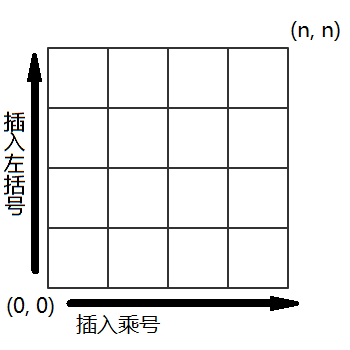
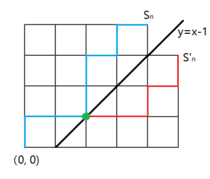

# 
Code Girl

Lunex Nocty

[toc]

## Prologue: Catalan Sequence

### 代码少女的日常

问题 0
>给定$n$个矩阵($n>0$)：$A_1,A_2,\cdots,An$，其中$A_i$与$A_{i+1}$是可乘的，$i=1，2...，n-1$。对于表达式$A_1A_2\cdots A_n$，有多少种不同的计算顺序？
当 $n=2$ 时，有且仅有 1 种计算顺序。
当 $n=3$ 时，有
$$\begin{aligned}
A_1A_2A_3 = ((A_1 \cdot A_2) \cdot A_3)\\
          = (A_1 \cdot (A_2 \cdot A_3))
\end{aligned}$$
共 2 种计算顺序。
当 $n=4$ 时，有
$$\begin{aligned}
A_1A_2A_3A_4 = (A_1 \cdot (A_2 \cdot (A_3 \cdot A_4)))\\
             = (A_1 \cdot ((A_2 \cdot A_3) \cdot A_4))\\
             = ((A_1 \cdot A_2) \cdot (A_3 \cdot A_4))\\
             = ((A_1 \cdot (A_2 \cdot A_3)) \cdot A_4)\\
             = (((A_1 \cdot A_2) \cdot A_3) \cdot A_4)
\end{aligned}$$
共 5 种计算顺序。
特别的，当 $n=1$ 时，有 1 种计算顺序。
PS：答案可能很大，请将答案对 $10^9+7$ 取模。

凛音静静的看着眼前这道题目，陷入了沉思。

这里是枫落学院代码社，如你所见，凛音现在正在进行社团活动中。

凛音对这个看似简单的题目毫无头绪，设当有$n$个矩阵时的有$C_n$种不同的计算顺序，目前知道的是$C_1=1, C_2=1, C_3=2, C_4=5$或许多写几个能发现规律？凛音这么想着，当$n=5$时，凛音拿起自动笔开始在草稿纸上列举。
$$\begin{aligned}
A_1A_2A_3A_4A_5 = (A_1 \cdot (A_2 \cdot (A_3 \cdot (A_4 \cdot A_5))))\\
                = (A_1 \cdot (A_2 \cdot ((A_3 \cdot A_4) \cdot A_5)))\\
                = (A_1 \cdot ((A_2 \cdot A_3) \cdot (A_4 \cdot A_5)))\\
                = (A_1 \cdot ((A_2 \cdot (A_3 \cdot A_4)) \cdot A_5))\\
                = (A_1 \cdot (((A_2 \cdot A_3) \cdot A_4) \cdot A_5))\\
                = ((A_1 \cdot A_2) \cdot (A_3 \cdot (A_4 \cdot A_5)))\\
                = ((A_1 \cdot A_2) \cdot ((A_3 \cdot A_4) \cdot A_5))\\
                = ((A_1 \cdot (A_2 \cdot A_3)) \cdot (A_4 \cdot A_5))\\
                = (((A_1 \cdot A_2) \cdot A_3) \cdot (A_4 \cdot A_5))\\
                = ((A_1 \cdot (A_2 \cdot (A_3 \cdot A_4))) \cdot A_5)\\
                = ((A_1 \cdot ((A_2 \cdot A_3) \cdot A_4)) \cdot A_5)\\
                = (((A_1 \cdot A_2) \cdot (A_3 \cdot A_4)) \cdot A_5)\\
                = (((A_1 \cdot (A_2 \cdot A_3)) \cdot A_4) \cdot A_5)\\
                = ((((A_1 \cdot A_2) \cdot A_3) \cdot A_4) \cdot A_5)
\end{aligned}$$

哇啊，竟然有多达14种组合，凛音放弃了继续写下去的想法，她很怀疑一页草稿纸能否列举完，而且也无法保证出错的可能性，但在写这些式子的过程中，她也确实感受到了某种规律性，既然有规律那么就应该有式子，现在要做的是把规律完全地找出来。

凛音注意到，当$n=5$的时候，有一些模式在重复的出现，但她还未能抓住那一闪而过的灵光，直觉告诉她，这个题或许是一个递归的结构，想到这里，她尝试对14种结果进行分组，如果仅关注最后一次运算的话，可以将结果分为4组，即：

$$\begin{aligned}
A_1A_2A_3A_4A_5 = ((A_1) \odot (A_2 \cdot A_3 \cdot A_4 \cdot A_5))\\
                = ((A_1 \cdot A_2) \odot (A_3 \cdot A_4 \cdot A_5))\\
                = ((A_1 \cdot A_2 \cdot A_3) \odot (A_4 \cdot A_5))\\
                = ((A_1 \cdot A_2 \cdot A_3 \cdot A_4) \odot (A_5))\\
\end{aligned}$$
PS: $\odot$用于表示出最后一次的乘法运算。

嗯？似乎发现了什么，在刚才写式子时就注意到的重复的模式，在这里被挖掘了出来。$A_2A_3A_4A_5$的计算顺序不正是当 $n=4$ 时的计算顺序吗？凛音用式子表示这个关系：

$$C_5 = C_1C_4 + C_2C_3 + C_3C_2 + C_4C_1$$

验算一下，$1\times5 + 1\times2 + 2\times1 + 5\times1=14$，嗯，完全正确，凛音觉得自己抓住了关键，将这个式子拓展到 $n$，那么就像下面这个样子。

$$\left\{
\begin{aligned}
C_1&=1 \\
C_n&=C_1C_{n-1}+C_2C_{n-2}+\cdots+C_{n-1}C_1, n>1
\end{aligned}
\right.$$

再来验证一下。
$$\begin{aligned}
C_2&=C_1=1\\
C_3&=C_1C_2+C_2C_1=2\\
C_4&=C_1C_3+C_2C_2+C_3C_1=5
\end{aligned}$$

嗯，到目前为止都很完美！那么接下来就是编码的环节了，凛音花了二十多分钟进行编码和调试，最终用写了一个递推版本的代码([code 0-1](https://github.com/lunexnocty/CodeGirl/blob/master/Code/code.0-1.cpp))，估计了一下这个程序的复杂度，是$O(n^2)$，她立刻在社团内部的在线判题网站上提交了自己的代码，随着一组又一组数据的通过，凛音的心也悬了起来。大概五秒后，最终结果出来了，一个大大的红色的TLE(Time Limited Error)出现在凛音的视野里，她知道这个题目又未通过。

带着不甘心凛音查看了详细的测试情况，一共100组测试数据，这份代码却只通过30%的数据，连一半的数据都没能通过。

这样的结果出乎凛音的预料，因为她实在想不通还有别的算法可以进一步降低算法的复杂度。

由于这是一个递推的式子，第一层循环避无可避，所以重点在于第二层循环吗？但是递推式就是这个样子的啊，只能继续深入这个递推式的特点，很显然，等号右边一共有$n-1$项，且每一项的下标之和都等于左边的下标 $n$，从 $C_1$ 计算到$C_{n-1}$，嗯？中间是不是有重复计算的？第一项和最后一项是一样的，只是交换了乘法的顺序，随着$n$的增大，重复计算的也会增多，而这部分多余地计算完全可以省略掉。

于是凛音很快对自己的代码进行了改进，在本地测试都通过了之后，提交了第二版的代码([code 0-2](https://github.com/lunexnocty/CodeGirl/blob/master/Code/code.0-2.cpp))。很快，结果再一次出现在凛音的眼前。

又是一次TLE，查看详细，这一次通过了45%的测试数据，看来这种程度的优化还是没法通过这个题。还能继续优化？凛音仔细打量着这个递推公式，确信没有其他的地方存在重复计算的情况了。看来无法利用这个递推公式解决这个问题吗，她如此想着。如果递推公式还不足以解决这个题目的话，那么就进一步，求出这个数列的通项公式如何？如果能获得$C_n$的通项的表达式，说不定可以在$O(1)$的时间复杂度内解决这个问题！凛音有些乐观的想着。

凛音对数列的了解仅限于等差数列与等比数列，所以尽管很努力的思考了，却依旧没有什么进展，直到校园的铃声打乱了她的思绪，凛音这才注意到，已经五点三十分了。

枫落学院的社团活动从下午三点半开始，五点半结束，到六点之前所有人必须离开学校。这一点和其他学校并没有什么不同。

该回去了，想到这里，凛音拿出自己的笔记本，把电脑上的题目抄到了最新的一页，还把之前得出的递推式写在了下面，并写上了求通项的提示，然后将作为书签用的丝带夹在那一页，装进了包里。关注了一下活动室的其他人，部长正在和水野镜同学聊些什么，之前都没注意到呢，想着这些无关的事情，一边向她们告别，一边向着门口移动。

「部长，水野同学，我先走一步」

也没有等待对方的回应，径直离开了活动室。

凛音一边思考着怎样求通项，一边一层层的走下楼梯，自然没有注意到视线之外的余裕，突然一股茶叶的清香传来，还未意识到什么，一股力瞬间将她推到在地上，毫无准备的摔倒让她稍微露出了痛苦的表情，不过并没有什么大碍。

「对不起！你没事吧？」凛音听到一位女生的声音，原来刚才是撞到人了吗？

「没事」淡淡地回应之后，凛音抬头看去，是一位有着茶色长发的女生，明明不认识这位女生，却有种淡淡地熟悉感，总觉得在哪儿见过的感觉，注意到领带的颜色，果然是一年级的。

「我来帮你捡」

凛音这才注意到，两人的书都散落在地上，立刻和对方一起慌忙的收拾地上的东西。

「这就是全部了」茶发女生将最后一本书放到凛音手上，静静地看着她。

「谢谢」凛音仅仅是保持着最基本的礼貌向面前这位陌生的同学道了谢，然后就打算直接离开，对方似乎还有什么话要说的样子不过凛音并没有在意。

匆忙别过的两人，丝毫没有注意到，一模一样的笔记本，已然被悄无声息的交换了。

### 放学路上

从办职员室里出来，已经是傍晚了，社团活动也差不多该结束了吧。果不其然，刚出门不久，铃声便响了起来，待到这么晚，进入高中之后还是第一次。今天叫我过去的是我的数学老师——藤原敬太(ふじわら けいた)，今天叫我过去似乎是为了确认我的数学成绩，在职员室做完了一套颇有难度的试卷之后，似乎是得到了他的认可才终于放我回家。

我所在的高中——枫落高中在沧海县当地是一座以学力而闻名的私立高中，说到枫落高中，据说其名字还有着一段故事，不过我并不太关心这种事情，所以并不是很清楚其中的细节，而我来到这所高中的目的，则是这所高中那令人安心的升学率。

作为在当地升学率最高的高中，其入学考试的难度自然可想而知，能通过的自然是原来学校中的佼佼者，心中难免有一些傲气，老师们的应对方法也很简单，便是在入学之后的第二周，组织了一场全校规模的大考——开学考，不但题目颇有难度，而且其成绩也会被记录在学生的档案之内。其目的自然是摸清学生们的真实学力，对于二三年级的学生来说，是对假期之后学生们是否松懈的检验，但对于一年级的新生来说，不免多了一层警告之意，向好不容易才考入枫落高中的新生们传达「你们目前的学力离枫落高中的要求还差得远呢！」这样的含义吧。大考之后，枫落高中的老师们预想之内的低分对于原学校的佼佼者们来说难免是一场打击，冲淡了考入枫落高中的骄傲，留下的则是不甘，将这种不甘化为学习的动力，或许正是老师们打着的如意算盘吧。

回到我被藤原老师单独留下的问题，自然与这次大考有关，在这次大考中，我——星野宇惠(ほしの うえ)，是在这次的考试中，唯一拿了满分的人。对于满分当然要慎重对待，于是在成绩发布之前，藤原老师便找到了我，希望我能证明我确实有拿满分的实力，而证明的方法也很简单，再做一套难度与开学考相仿的试题便是，由于是临时出的题目，自然也没了作弊的可能，其结果似乎令他相当满意。因此在我完成试卷，他也确认了答案之后，藤原老师很干脆地放我离开了。

虽然对被强行留校到现在有点怨言，但我也没办法向老师直诉不满，便也只能作罢。正巧这时响起了社团活动结束的钟声，让我想起了我还有一位参与社团活动的友人或许现在还没有回家，自从她加入社团之后，一起回家什么的，便再也没有过了，想到这里，难免升起了一股和我那位友人一起回家的冲动，我便稍微饶了绕路，没有直接离开教学大楼前往校门，而是一边思考怎么应对我的友人，一边思考着学校的平面图，往东边的社团大楼移动。

.png)

图0-1 学校俯视图

东边的社团大楼的两个出口分别设在大楼的东西两侧，开口自然是面向运动场的北方，来到了社团大楼的侧面，左边就是运动场，右转就是社团大楼的靠仅西边的出口，心思没在状态的我自然没有考虑到现在社团活动刚刚结束，正是人流量最大的时候，而毫无准备的我自然也不会料到正好有位同学刚结束了社团活动而从楼梯口出来，然后两个人完美的撞在了一起。

或许是对面正打算转弯的关系，总之对方没能把握住平衡而向后摔倒在地，我则勉强保没有倒下，这得以给了我打量对方的时机。映入眼帘的，是一头漂亮的黑色长发，只有一个简朴的发带稍微束住了两鬓的头发，让整个人看起来要精神了一点，胸前绿色的领带则表示眼前的这位同学和我一样是一年级新生，脸上则是有些痛苦的表情，看起来应该是摔倒屁股了，看起来很疼的样子。

「对不起！你没事吧？」

虽说是两个人撞在一起了，但就结果而言对方受到的伤害更大，就道理而言我也应该靠左行，所以这一起事故的责任可以说几乎都是我的责任，我自然没有推卸的打算。

「没事」疼痛似乎有些缓解，对方也完全没有继续追究的意思，虽然语气有点冷漠。这让我有点安心，要是对方非要追究的话我却并不擅长那种场面，到时候怕是只得求助于我的友人来调解，但我向来是不愿意欠别人人情的，因此倒是对眼前的女生平白多出了几分好感。她坐在地面上没来得及起身，我便主动请缨收拾二人的散落在周围地面上的东西，主要是书籍，笔记本还有手帕钱包等杂物。

「我来帮你捡」说着的时候，便已经蹲下去了，两人的东西完全混在了一起，好歹我对自己的东西有着充足的印象，倒不至于拿错。对方似乎也意识到了，也忍着疼痛迅速站起来帮我一起收拾。

「这就是全部了呢」我把最后一本笔记交到她手上，想着作为赔礼下次要不要请她喝杯茶呢什么的。

「谢谢」然而事与愿违，我还没来得及表示我的想法，她便急匆匆地离开了，没有一丝的逗留，难道有什么急事吗？

就算想也想不明白，只好把这件事情抛在一边，把我自己的东西放进书包里，稍微往左边靠了靠，不至于再一次发生撞到人的惨剧，观察着来往的行人。

无论是从西边楼梯下来的，还是从东边楼梯下来，然后从走廊过来的学生，大多都是两三人一起，鲜有单独一人的，这倒是让独自在走廊等待的我有些显眼，我从来就不善于暴露在人的目光之下，等待的时间也因此显得有些难熬，我便也趁此机会思考起我所等待的这位友人所参加的社团。

枫落高中虽说是以学力著称的升学高中，但这并不意味着社团活动就毫无活力，正相反，由于招收的学生大多是个初中的佼佼者，社团活动更显得丰富多彩，学校似乎对社团活动也颇为支持，无论是在校规上还是在经费上都极为支持社团的发展，而学校确实也有几个称得上有名气和历史的社团，比如文学社，化学社，篮球社，足球社等，但据我所知我的友人并没有加入这些颇有实力的社团，而是加入了一个似乎由于人数不足而面临废部危机的社团，具体的社团的名字我并没有特意去记住，唯一有印象的是社团只有一位三年级的前辈和两位一年级的新生，三年级的前辈很少姑且可以强行解释为升学的压力，但二年级的前辈一个也没有就很值得推敲了，由于社团目前还没有废部，所以在一年级的两位社员加入之前社团是切实存在的，也就是说社员人数必然是不少于5人的，所以这学期开学后，剩下的4名社员去哪儿了？三年级的话可能是迫于升学的压力不得不离开，那么二年级呢？总不能上一届完全没有招到新社员吧？因此我倾向于社团发生了什么事情导致大量社员退社，才导致了废部的危机，至于具体是什么事情，便不是我能推究的了，可能是新任命的部长不受待见吧，虽说只是毫无根据的推测，却也让我对这位素未谋面的三年级前辈产生了些许芥蒂，同时对在这个时期入社的一年级新生产生了好奇。其中一位自然就是我的友人，她那面对任何新鲜的事物的好奇心而做事不经大脑的行动很可能因为一时冲动而入部，另外一位便不好说了，或许我的友人会找个时机引荐给我也说不定。

心中想着些有的没的，倒也缓解了我独自一人等待在走廊的尴尬，不一会儿，一个熟悉的的声音将我从我的思绪中解放了出来。

「啊嘞？宇惠？为什么会在这里？」我将视线投入到声音的源头，熟悉的金发双马尾显示着她的身份，我所等待的友人——水野镜(みずの かがみ)，从初中开始就是同学，最后勉勉强强和我一起考进了枫落高中，算得上是我最好的朋友。镜的声音听起来有些惊讶，毕竟我没有加入任何社团，现在这个时候还留在学校的确出乎她的意料，我也注意到镜并不是单独下来的，在旁边陪着她一起的应该就是社团现任的部长，那位三年级的前辈，告诉我答案自然就是那胸前的紫色领带，这位前辈有着咖啡色的长发，和之前不小心撞到的人不同的是，并没有束起来，而是自然的垂下，刘海附近别了几颗发夹防止眼睛被遮住，拜此所赐我能很方便的看清这位前辈的容颜，单从外表而论绝对担得上美人这个称呼。

「您好(御機嫌よう)，前辈，我是一年级的星野宇惠，水野镜同学的朋友，初次见面，请多关照。」由于前辈在场，自然不能失了礼数，虽说因为刚才的胡思乱想让我对这位前辈并没有太好的印象，但终究不能表现出来，免得前辈由于我的缘故而对镜留下不好的印象。

「不用那么礼貌也可以哦，星野同学，我是代码社的部长，小宫夜羽(こみや よはね)，既然是星野同学是特意来等小镜的，我也不便打扰，那么，小镜，我先走了」前辈似乎并不是特别看重礼数，也很适宜的和镜告别，看起来，似乎是为不错的前辈，不像是那种会招致怨恨的人，这让我对这个社团二年级消失之谜产生了更多的疑问。从对镜的称呼来看，短短一两周和镜的关系便已经如此之好，不知是镜更加主动还是两人确实投缘。总之这一次见面倒是一改之前我对小宫前辈的印象，我也在心中为之前对小宫前辈不好的想象而道歉。

「啊，夜羽学姐，再见！」镜似乎才从惊讶中恢复过来，连忙向前辈道别，不过礼数却并未到位，不过我已经知道小宫前辈对礼数并不是非常在意，而且这么久前辈也应该知道了镜的性子，我也懒得去纠正什么了。随后夜羽前辈便离开了，我以为她会顺着人流径直回家，结果我又一次猜错了，她去了教学楼周围停放自行车的区域，看来是骑自行车上下学的。在我打量着夜羽前辈的时候，镜已经来到了我面前。

在先用书包碰了我一下，确认我将注意力转移到她身上之后，才开启话题问道，「宇惠今天怎么会在这里等我？」脸上满是好奇，一个放学了就立刻往家里跑的人为什么会等上两个小时之久，要说是专门等她的话镜是万万不信的。

由于在走廊并不是什么说话的好地方，我示意镜我们边走边说，两人并肩走在了回家的道路上。

「今天放学后被藤原老师叫过去了」面对升上高中后唯一的友人，我也并没有隐瞒的必要。

「藤原老师就是那个教数学的那个？真的是年轻又帅气，在我们班引起了不小的骚动呢！呐呐！到底是因为什么事情叫你过去啊？真好啊，我也想和帅气的藤原老师单独相处呢~」原来藤原老师这么受欢迎吗？

「就算是被强制在教职员室做了两个小时的试卷？」

「欸？那是什么？可怕……」镜大概在脑海中想象了一下，立刻露出了嫌恶的表情，心中对藤原老师的评价大概下降了不少，学生，终究是讨厌考试的，特别是这两天刚大考结束，而镜爱玩的性子注定不会对考试产生好感，镜停顿了一下，接着问道，「宇惠的数学成绩很不错吧，为什么会被单独叫过去啊？」

「大概是上次大考我拿了100分。」

「……能一脸平静的说出拿了100分这样的事实，在某种意义上比拿了满分还要厉害……欸？上次的大考？开学考？那不是超难的考试吗？数学那一科的题目我都看不懂，你到底是何方神圣！」

面对开始耍宝的镜我不禁莞尔，对藤原老师的不满随着镜的声音一起消失在沧海县的街道。

「普通的高中生啦！」我也顺着氛围敲了镜的头，只见她夸张的双手抱头，蹲在地上向上看着我。

「好过分……」这样拙劣的演技自然骗不过与她熟识的我，我便不再理睬她，而是直接从她旁边走过，心中则提防着有可能出现的恶作剧，果不其然，我刚走过她身边，一之手就抓住了我的裙子，虽说我早有提防，可总就是敌不过镜的速度。我只好站在原地，看着她抓着我的手站了起来，我则是尽力摆出一副生气的样子，要是我的裙子在公共场合不小心被扯掉了，对于女孩子来说真是难以想象的地狱。

或许是看出了我脸色有点黑，镜也适时地收起了玩笑，「抱歉抱歉，谁让你打算丢下我的。」完全看不出有反省的样子，不过刚才我确实有丢下她的打算，便也只得作罢。在收下了镜作为赔礼送给我的可丽饼之后，话题转移到了镜的社团。

「社团活动？嗯，做有趣的游戏？」镜歪着头思考道，「什么什么？宇惠终于对我们社团产生兴趣了吗？要加入了吗？」并不会哦，辜负了你的期待真是抱歉，由于刚刚收下镜的可丽饼，我并没有直接说出来，而是问起了其他的东西。

「那镜加入社团的契机是什么？」

「说到这个，宇惠你知道有个叫做『枫落吴江』的app吗？啊，我忘了宇惠没有智能机。」后知后觉的镜靠近了我，展示她的手机给我看，点击了一个有着枫叶图标的程序，一边操作一边介绍道，「这个app就是我们代码社制作的，虽说实际制作的只有夜羽前辈一个人啦，去年的时候发布在网上的程序，是一个校园社区的程式，里面介绍了大量枫落高中的校园信息，包括学校介绍，社团介绍，教师介绍等对新生来说非常有用的信息，而且还有自媒体平台，还可以在上面发贴，聊天等，总之是一个非常实用的app，但是唯一的缺点，嘛，你也看到了，界面太难看了，要是能配上更加可爱一点的背景的话肯定能更受欢迎的吧。」诚然，正如镜所说，这个app的界面确实不怎么好看，对这个注重产品外观的时代想必用户也不是特别的多吧。不过，原来镜加入的社团叫代码社啊，我倒是没办法从名字看出来是个怎样的社团呢。

「确实是个很有用的app，但仅凭这样就能让你加入这个社团？」对于镜的好玩的性子我是深有体会，断然不会仅凭这个app就让她放弃其它社团的诱惑，因此一定还有什么决定性的事物。

「欸嘿嘿，不愧是宇惠。」镜打开了程序中的小程序界面，出现在眼前的则是好几款小游戏，每一款游戏还有一个排行榜，一个id名叫『Mirror』的用户在每一款小游戏的牌名都颇为靠前，想必那便是镜在这个社区的id吧。排行榜的用户并不多，倒是不能看出镜的游戏水平怎么样，但也为解答我小镜为何会加入这样一个社团的疑问。

「这里面的游戏都非常的有趣，我对游戏的制作者也是十分的倾佩，所以就带着我能不能也做出有趣的游戏呢的想法，然后就按照这个app提供的地址去了代码社，当时部长很明确的告诉我，只要去做，就可能做到，但如果不去做的话，就一定没可能做到。」我想着这种正确的废话估计也只有镜才会上当了吧，镜模仿着夜羽前辈的语气，「『如果你真的想做出好玩的游戏的话，我会从基础开始一点一点教你的，所以请尽情的加油吧！』，被那样说了的我就顺势加入了社团，就结果而言，果然作游戏还是太难了，宇惠要是一起的话绝对会轻松许多的。每天都在社团不停的学习学习，回到家还要应付老师们留下的作业，这样下去迟早有一天会被榨干而亡的，到时候我一定会把错误归结到宇惠的头上，每天晚上都去敲宇惠房间的窗……」不知不觉就变成了诉苦大会，而且有着做鬼也不放过我的趋势，我立刻打断了镜的自我演绎，虽说我对怪力乱神什么的向来嗤之以鼻，但世界之大无奇不有，面对大自然还是要保持最基本的敬畏之心，所以趁话题向着鬼故事发展之前终结这个话题。

女子高中生之间总有讲不完的话题，特别是进入了一所新的高中，我和镜也在不同班的情况下，我们分享着各自在学校的见闻，不知不觉就回到家了。

### 在家中解生成函数

久违的和朋友一起回家，感觉确实很不错，至少我现在的心情是非常开心愉快的，洗完澡，吃过晚饭，回到房间之后，已经是晚上七点半了，将心中的愉悦抛出脑海，开始完成今天的作业。

由于前两天的大考，老师们也都忙着批改试卷，所以留下的作业非常少，今天也是只有国语，英语和化学的作业，花了不到一个小时的时间处理完所有的作业之后，不免有些无所事事，出去泡了一杯热茶之后，也终于决定了接下来的计划，从包里拿出我的笔记本开始预习明天的功课。虽说在理科方面颇有自信，但国语向来是我最为薄弱的学科，这份缺陷在枫落高中或许会被成倍的放大吧，带着这样的危机感我同时翻开了课本和我的笔记本。

「嗯？」笔记本上记录的内容却并不是我在课堂上留下的笔记，而是一道说法有些奇怪的题目，面对这种预料外的事实大脑一时有些宕机，这道题目倒也因此给我留下了比较深刻的印象。

欸……？不是我的笔记本？

我面前的，是和我的那本笔记本的封面一模一样的笔记本，为了确认，我翻到第一页，上面用清晰的字迹显示着一个陌生的名字——天音凛音(あまね りんね)

一年D班，和镜同样的班级。

脑中立刻浮现出傍晚和我相撞的那位黑发的女生。我向来没有拿别人东西的习惯，我在班上也没有走的足够近的朋友，最后可能发生问题的环节，只能是今天下午的那一场事故，所以，这个笔记本的主人，毫无疑问应该就是那位身高有些矮小的黑发女生了吧。以防万一，我还是先和镜确认一下比较好。我来到客厅，用家里的座机拨通了镜的手机，很快，镜的声音出现在话筒。

「你打断了我的学习！」我自然是不信的，她只会因为有借口而得以短暂地逃离学习而感到高兴，所以我更倾向于她现在正在玩游戏，而被我的电话打断了。

「反正又是在玩音游吧，你也不担心被水野阿姨发现，我打电话给你是有事情想问你，你们班上是不是有一位叫天音凛音的学生？」

「欸？你怎么知道？」看来没错了，我只好把我撞倒天音同学，随后又不小心拿错了笔记本的事情原原本本告诉了镜。

「一样的笔记本……一样的笔记本……」镜似乎对于我和天音同学用着一模一样的笔记本一事很是在意，不过现在的问题是天音同学是个怎样的人，我该怎么把笔记本还给她。

「镜，你对天音同学的认识有多少？知道她家住哪儿吗？」

「天音同学正是我们代码社的第三名成员哦！」欸？这么巧？我心中感叹了下人与人之间的巧合，继续听着镜的描述。「虽然我们在同一个班也在同一个社团，但我和她聊天的次数着实不算多，她总是一个人呆着，沉默寡言，在教室也很少和人说话，下课了也没见她和朋友聊天，社团活动倒是从来没有缺席过，但也是一个人坐在角落里努力，在编程方面有着不小的实力，很少需要学姐的指导，夜羽学姐似乎也很看好她，总体来说是个有些奇怪的人，我也没能顺利的和她成为要好的朋友，住址什么的，当然不知道了。那个笔记本我知道，是那个有着星空图片封面的笔记本吧，当时我就想着宇惠可能会喜欢，没想到你居然真的有一个。天音同学的那个笔记本主要记录的是自己在社团活动中遇到的不会的题目，虽说上课时用不到，不过对于天音同学来说还是挺重要的。」

镜的描述和我今天看到的天音同学大致还是非常吻合的，话很少，有点冷漠和镜这种外向的人简直是两个不同的极端，但为人礼貌，心胸也很宽广，而且似乎还是一位努力的人。我向来是不吝于向努力的人献上敬意，我对天音同学的评价又高了几分。

「那只好我明天课间去交给她了吗。」我低声呢喃着，暗自做了打算。

「明明直接拜托我交给她就好了，就对天音同学那么感兴趣吗？」镜还是听到了我的低语，一时之间我竟也有些慌乱。

「亲手交给她才能显示我的诚意吧，好了，我不打扰你学习了，请加油学习！」无视了镜试图挽留以延长面对作业的时间的打算，我挂掉了电话，镜真是，在这种方面意外的敏锐，我确实有想更多的了解天音同学这个人的想法，不仅是第一次见面的好感和刚才镜对她的描述，还包括了眼前的笔记本，上面记录的那一道题目。

>$$\left\{
\begin{aligned}
C_1&=1 \\
C_n&=C_1C_{n-1}+C_2C_{n-2}+\cdots+C_{n-1}C_1, n>1
\end{aligned}
\right.$$
求$C_n$的通项公式。

上面用规范的字迹写下了一个关于矩阵连乘的不同顺序的个数问题，以及我所关注的，天音同学所得到的关于${C_n}$的递推式，以及求通项的提示。数列这个东西自然是不陌生的，虽说数列并未纳入初中数学的教学大纲，但为了应付枫落高中的入学考，不少以枫落高中为目标的学生都对数列有着最基本的认识，等差数列和等比数列更是必考的考点，自然不会有太大的问题，但看这个递推式的形式，显然并不是简单的等差数列或者等比数列，想要用初中的知识去解决这个问题，无异于有些难度，我自认为数学在同龄人之中还算出众，便有了挑战这个题目的心思。

简单验证了天音同学给出的递推式无误之后，我拿出草稿纸开始了进一步的推导。

首先关注这个递推式的形式，$C_n=C_1C_{n-1}+C_2C_{n-2}+\cdots+C_{n-1}C_1$，用 $\sum$ 表示的话就是这样，$C_n=\sum\limits_{k=1}^{n-1}C_kC_{n-k}$，显然是卷积的形式，很难直接通过对递推式的变形来求解，这个时候或许需要借助一下生成函数这个工具了。

定义函数$C(x)$

$$C(x)=\sum\limits_{k=1}^{\infty}C_kx^{k-1}$$

嗯？感觉不太好看，稍微修改一下吧。

$$C(x)=\sum\limits_{k=0}^{\infty}C_kx^k$$

为了让式子更加富有美感，我把$C_0$当作数列的第一项，最后只需要做一个简单的转换就好了。

看到卷积，那么，考虑对$C(x)$平方，可以得到

$$C^2(x)=(C_0C_0)+(C_0C_1+C_1C_0)x+(C_0C_2+C_1C_1+C_2C_0)x^2+\cdots$$

进行一般化，$x^n$的系数是多少呢？我不停的计算着，脑子里只剩下了眼前的式子，取不同的组合，再将$x^n$的系数加起来……啊！眼前的式子让我很惊喜。

$$\begin{aligned}
&\quad C_0C_n+C_1C_{n-1}+\cdots+C_kC_{n-k}+\cdots C_{n-1}C_1+C_nC_0\\
&=\sum\limits_{k=0}^nC_kC_{n-k}
\end{aligned}$$

它正好是$C_n$的递推式，于是，$C^2(x)$就可以很简单的表示为

$$C^2(x)=\sum\limits_{k=0}^{\infty}C_{k+1}x^k$$

那么，接下来的操作就很顺理成章了。

$$\begin{aligned}
xC^2(x)-C(x)=&\sum\limits_{k=0}^{\infty}C_{k+1}x^{k+1}-\sum\limits_{k=0}^{\infty}C_kx^k=-C_0\\
&xC^2(x)-C(x)+C_0=0
\end{aligned}$$

由于修改了初始定义，使$C_0=1$，代入其中直接可以求解

$$C(x)=\frac{1\pm \sqrt{1-4x}}{2x}$$

咦？出现了两个解？我们知道$C_0=1$，所以$C(0)=1$，由于分母不能为零，于是求$\lim\limits_{x\to0}C(x)$

$$\lim\limits_{x\to0}\frac{1+\sqrt{1-4x}}{2x}=\infty\\
\lim\limits_{x\to0}\frac{1-\sqrt{1-4x}}{2x}=1$$

取正根时，函数甚至不收敛，显然这里保留负根，于是得到$C(x)=\frac{1-\sqrt{1-4x}}{2x}$。

呼~似乎完成了什么重大的事情一样，我长长地呼了一口气，接下来的步骤就比较容易了，在此之前我决定先喝一杯茶再继续。

小小的抿了一口才意识到茶杯中的茶都凉了，我只好起身去客厅续了一杯热茶。

喝了一口热茶，回到了书桌，继续未完成的作业。

接下来要做的事是将$C(x)$进行泰勒展开，然后通过比较系数来得到$\{C_n\}$的通项，直接对$C(x)$求导？略微思考一下就会发现这个工作量太过巨大，而且求导的目的是为了泰勒展开获得$x^n$的系数，这种复杂的函数求导很难对系数进行一般化。

提前将直接泰勒展开的思路掐灭掉之后，我开始考虑另外的方法。

将式子变形看看。

$$\begin{aligned}
2xC(x)&=1-\sqrt{1-4x}\\
2x\sum\limits_{k=0}^{\infty}C_kx^k&=1-\sqrt{1-4x}\\
2\sum\limits_{k=0}^{\infty}C_kx^{k+1}&=1-\sqrt{1-4x}
\end{aligned}$$

好像可行！那么，定义函数$f(x)=\sqrt{1-4x}=\sum\limits_{k=0}^{\infty}F_kx^k$，由于$f(0)=1$，所以$F_0=1$，带入前面的式子的话

$$2\sum\limits_{k=0}^{\infty}C_kx^{k+1}=1-F_0-\sum\limits_{k=1}^{\infty}F_kx^k=-\sum\limits_{k=1}^{\infty}F_kx^k$$

直接比较$x^n$的系数，可以得到

$$C_n=-\frac{1}{2}F_{k+1}$$

前路逐渐变得明朗起来，接下来只需要求出$f(x)$的在$x=0$处的展开式就可以了，已知泰勒展开式

$$f(x)=\sum\limits_{k=0}^{\infty}F_kx^k=\sum\limits_{k=0}^{\infty}\frac{f^{(k)}(0)}{n!}x^k$$

反复的对$f(x)$进行微分

$$\begin{aligned}
f(x) &= (1-4x)^{\frac{1}{2}}\\
f'(x) &= -2\cdot(1-4x)^{-\frac{1}{2}}\\
f''(x) &= -2\cdot2\cdot(1-4x)^{-\frac{3}{2}}\\
f^{(3)}(x) &= -2\cdot4\cdot3\cdot(1-4x)^{-\frac{5}{2}}\\
f^{(4)}(x) &= -2\cdot6\cdot5\cdot4\cdot(1-4x)^{-\frac{7}{2}}\\
&\vdots\\
f^{(n)}(x) &= -2\cdot\frac{[2(n-1)]!}{(n-1)!}\cdot(1-4x)^{-\frac{2n-1}{2}}\\
f^{(n+1)}(x) &= -2\cdot\frac{(2n)!}{n!}\cdot(1-4x)^{-\frac{2n+1}{2}}
\end{aligned}$$

得到$f^{(n+1)}(x)|_{x=0}$的值为

$$f^{(n+1)}(0)=-2\frac{(2n)!}{n!}$$

很自然的得到$F_{n+1}$的值为

$$F_{n+1}=\frac{f^{(n+1)}(0)}{(n+1)!}=-2\frac{(2n)!}{n!(n+1)!}$$

至此，得到了$\{C_n\}$的通项公式，

$$
C_n = -\frac{1}{2}F_{n+1}=\frac{(2n)!}{n!(n+1)!}=\frac{1}{n+1}\frac{(2n)!}{n!(2n-n)!}\\
C_n=\frac{1}{n+1}C_{2n}^n,n\geq0
$$

正当我以为大功告成的时候，验算的时候却发现对不上，按照我算出来的通项，数列应该是$C_0=1,C_1=1,C_2=2,C_3=5,C_4=14,\cdots$，显然和天音同学写的递推公式不吻合，恰好错位了。

我只好再从头开始看我的推导过程。啊，原来是定义$\{C_n\}$的生成函数的时候为了形式的统一修改了定义，我还以为我中途算错了。只需要稍微修改一下下标就可以得到符合天音同学给出的递推式的通项公式。

我写下了我得出的结论。

$$\left\{
\begin{aligned}
C_1&=1\\
C_n&=\frac{1}{n}C_{2(n-1)}^{n-1},n>1
\end{aligned}
\right.$$

将结论写在了笔记本上，我不禁长长舒了一口气，这个题目的难度远超我的想象，如果不是有了解过生成函数这种就算是高中也极少用到的工具，或许我便会和天音同学一样对这个题目手足无措吧，不过，做完之后重新审视一边最开始的题目，我却察觉到了一丝违和感。题目的说法似乎有些奇怪，这个暂且不提，至少对于理解这个题目的意思没有影响，求的是有多少种不同顺序的个数，从表述上来看更像是一个排列组合类型的题目，而最后的通项也确实旁证了这一点，而排列组合则在高中的教学大纲范围内了，不至于像生成函数那么偏门，或许这个题有着其他的解法。

### 另外一种解法

连喝了两杯茶，让我产生了一丝尿意，我带着空了的茶杯，到厨房洗干净之后暂时放到了客厅的茶几上，上了个厕所，顺便用冷水刺激一下有点发烫的脸，看了看客厅的挂钟，已经到九点二十几分，父母正在看电视，上面播放着青春连续剧，我倒是也好奇为什么步入中年的双亲会对这种类型的电视剧感兴趣，但我终究没能问出口，毕竟母亲的年龄问题不可提。

脑中仍旧环绕着刚才那个题目的另外一种解法，我觉得今晚上不做出来我可能是睡不着了，于是从茶几上拿出了一包茶叶，打算再给自己泡一杯茶。

「都这么晚了，你还要喝茶？这都第三杯了吧？」母亲的声音传来，果然是注意到了吗。睡前喝茶并不是什么良好的习惯，但一边喝茶一边思考数学题是我为数不多的乐趣之一，只有这点绝对不能让步。心中思量着应付母亲大人的质询，手上的动作却没有停下来。

「大概是今晚的料理有些咸了吧，所以今晚频繁口渴。」对不起，其实母亲大人的料理很好吃，但我总得给自己找个借口。

「真的吗？爸爸，今晚的料理真的有些咸了吗？」对自己的厨艺怀疑的母亲转而向父亲大人取证，然而父亲和我可是品茶的统一战线联盟，他自然明白我心中的小算盘，因此倒也没有戳穿，反而是赞同的点了点头，母亲大人因此陷入了自我怀疑的深渊，我得以顺利地带着泡好的茶回到了房间。

重新审视这个题目，由于已经走过了天音同学的思路，倒让我得以仔细推敲题目中的信息，题目需要我们求得的是不同计算顺序有多少种，而且还强调用括号来区分不同的运算顺序，我开始关注于表达式的符号的排列上，显然，对于$n$个矩阵相乘的表达式来说，总有着$n-1$对括号，$n-1$个乘法与$n$个矩阵，符号的总数和类别总是固定的，这给了我一种重新解释这个题目的思路——排列数。

由于括号总是成对出现，而乘号的位置和矩阵的符号也总存在着关系，如果我去掉所有括号的右括号和矩阵本身的符号，只保留左括号和乘号，能否唯一的确定一个计算顺序呢？于是我开始验证，当$n=3$的时候，去掉右括号和矩阵之后的符号串为 $((\cdot\cdot$ 和 $(\cdot(\cdot$ 。尝试去按照规则还原，果然，就算去掉了右括号和矩阵本身的符号，也不影响这个符号串表达的含义，这让我对这个方法的可行性增添了些许信心，至于为什么去掉的是矩阵本身的符号而不是去掉乘号，自然是因为乘号的数量比矩阵本身的数量少一个。

经过上述的整理和简化，现在的问题简化成了求$n-1$个右括号与乘号的排列问题，当然，对于一般化的问题，求关于$n-1$的表达式与求$n$本身的表达式之间并没有什么不同，无非就是初始条件的区别而已，因此，我再一次自作主张的修改了这个问题。

>求$n$个乘号与$n$个左括号的排列数。

当然，如果仅仅是这个程度的问题倒也不至于难道我，总共有$2n$个符号，也可以理解为$2n$个空位，要向其中插入$n$个左括号和$n$个乘号，从$2n$个空位中选$n$个方括号，答案可以直接写出来：$C_{2n}^n$，但其中存在着一些不符合要求的排列，需要我们剔除。现在的难点在于，如何才能找到哪些符合要求的排列，而哪些又是不符合要求的排列，找到这个标准才是这个问题真正需要思考的地方，而这个问题或许得回到问题本身去寻找答案。

正当我的思绪告一段落，正端起一口茶享受的时候，门口的敲门声适时地响起，从略有些急促的敲门声我判断出这是母亲大人在敲门，说了声请进之后，开门而入的果然是母亲。她知道我不喜白开水，手中端着的是一杯鲜榨的苹果汁。看到我手上端着的茶杯，果然开始了说教，「晚上喝太多茶容易失眠，对肠胃也不太好，你怎么就是不听呢。」我只好傻笑着试图萌混过关，母亲倒也没再追究，而是看向了我的草稿纸，开启了另外一个话题，「枫落高中学习压力虽大，但也没必要这么努力吧，升到高中了，有加入什么社团吗？有什么兴趣爱好的话我们也挺支持的。」可能是刚才看了青春连续剧的原因，母亲居然关心我的社团活动了，我自然是没什么想要加入的社团，对天文社倒是有些兴趣但半夜出去观星什么的自然不会得到允许，爱好喝茶却也达不到品茶的境界，如果加入茶道社估计会引起许多人的不满，枫落高中似乎也没有什么数学类社团，所以我完全没有加入任何社团的想法。对此我只好含糊其辞，说找到感兴趣的就会参加，母亲对我向来是很放心的，便不再多说，嘱咐我早点休息，顺便没收了我喝了一半的茶。

虽然茶没了，但该做的事情还得继续，我只好再一次翻开了天音同学的笔记本，从题目中寻找有助于我解题的信息。我通过去掉右括号和矩阵符号，得到了一个符号串，那么，这个符号串是可以还原成原来的式子的，那么，是不是对于所有的排列都能还原呢？我只好运用其最原始的方法——列举法。

为了使列举的数量不至于太大，我选择了两个左括号和两个乘号，将它们的全排列一一写在了草稿纸上：
$$
((\cdot\cdot \quad (\cdot(\cdot \quad (\cdot\cdot( \\
\cdot\cdot(( \quad \cdot(\cdot( \quad \cdot((\cdot 
$$

通过好几次尝试，能还原出合法的表达式的只有前两个排列，后面的4种排列却怎么都没办法还原出一个可计算的表达式。所以，只需要排除掉不能还原的排列就可以了。能够还原的排列有着什么特征呢？这个问题在我之前尝试还原的时候就隐隐明白了，后面的4种排列，在添加右括号的时候总有不少于一个乘号落在了括号外面，而前两个刚好能把所有的乘号都放进括号里，一个可计算的表达式的所有乘号肯定只能在括号里面。为了进一步寻找到这个可计算的条件，我每添加一个 $)$ ，便把 $(\cdot)$ 直接去掉，去掉这种说法有点模糊，更严格的说法是，将 $(\cdot)$ 替换为空串，合法的排列总能不停地利用右括号将 $(\cdot$ 替换为空串。这样，我每添加一个右括号，就可以计算一次，如果整个排列是可计算的，那么最后一定可以得到一个空串！我把可以得到空串的排列称为可消的符号串，所以问题变成了求求$n$个乘号与$n$个左括号的排列中，可消的排列有多少种。

>符号串可以还原成可计算的表达式 $\Leftrightarrow$ 符号串可消

对于任意一个符号串，如果乘号的左边是一个左括号，那么我们便可以将 $(\cdot$ 替换为空串，如果要求整个符号串都是可消的，那么所有的乘号左边都得有一个左括号，也就是说，在任意一个位置的左边，左括号的个数不可能少于乘号的个数，否则就会有一个乘号因为没有可以匹配的左括号而无法被消掉，所以，『符号串是可消的』等价于『在任意一个位置的左边的符号串，左括号的数量不少于乘号的数量』。任意一个位置的左边这种说法感觉不太严谨，或许我该换一种更为严谨的说法：

>符号串可消 $\Leftrightarrow$ 符号串的所有前缀的左括号的个数不小于乘号的个数。

我习惯性的伸手去拿右手边的茶杯，却扑了个空，我才想起茶已经被母亲带走了，我只好退而求其次，用苹果汁代替茶。

既然已经证明了符号串可消性与任意前缀之间的符号数量关系之间的等价性，接下来自然就是将这个数量关系转化为公式。

这种求排列数的题目，往往可以通过画图的方式来直观地得到结果，对于插空模型，自然也有一套图形来解决类似的问题，这个模型我一般称之为网格路径模型。这里需要插入的是括号，从左下角出发，向右或向上移动，每走一格意味着处理完一个空位，向上走表示插入左括号，向右走表示插入一个乘号，那么，最后所有的空位都插满时，停留的位置必然是$(n,n)$这个网格，问题就转化为了从$(0,0)$移动到$(n,n)$一共有多少条不同的路径问题。

图0-2 网格路径模型

路径上的每一个点都表示一个符号串的一个前缀，要求对于任意一个前缀都满足括号的数量不得少于乘号的数量，等价于要求路径不得穿过$y=x-1$这条直线，怎样才能把穿过这条直线的路径去掉呢？这个问题的答案意外的比想象中的简单，只要把这条直线当成一个镜子，在第一次穿过这条直线之后，所有的移动方向都交换，那么最后到达的路径一定是$(n,n)$关于直线$y=x-1$的镜像点，也就是点$(n+1,n-1)$

图0-3 镜像点

这样一来，问题便得以解决，设符合条件的路径数位$C_n$，到达$(n,n)$的路径条数位$S_n=C_{2n}^n$，到达$(n+1,n-1)$的路径条数为$S'_n=C_{2n}^{n-1}$，那么可以得到关系式

$$C_n=S_n-S'_n$$

接下来就是简单的数学计算了，我在草稿纸上迅速的写着

$$\begin{aligned}
C_n &= S_n - S'_n \\
    &= C_{2n}^n - C_{2n}^{n-1} \\
    &= \frac{(2n)!}{n!\cdot n!} - \frac{(2n)!}{(n-1)!\cdot (n+1)!} \\
    &= \frac{(2n)!}{n!\cdot n!} - \frac{n\cdot(2n)!}{(n+1)\cdot n!\cdot n!} \\
    &= \frac{(2n)!}{n!\cdot n!} (1 - \frac{n}{n+1}) \\
    &= \frac{1}{n+1}C_{2n}^n
\end{aligned}$$

和我之前通过生成函数得到的通项公式一模一样，当然，这次我可不会忘记之前关于$n$定义的小修改，所以别忘了将$n$的定义修改回去的时候公式也需要小小的修正一下，即

$$C_n=\frac{1}{n}C_{2n-2}^{n-1}$$

比起第一种做法，文字证明变得多了，公式却变得少了，无疑更加地简单明了。

我一口气喝光了剩下的果汁，看了看时间，差不多十一点多了，再不睡觉的话可能会被骂吧，客厅里已经没人了，我将杯子洗净放好之后，又去上了次厕所，才回到了房间准备睡觉。突然想到，我似乎没有预习明天的功课……